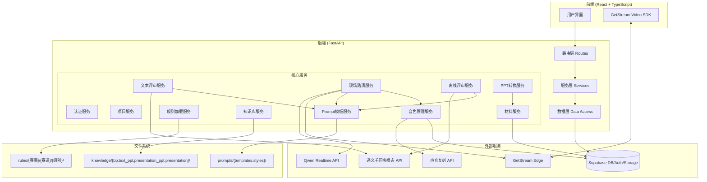
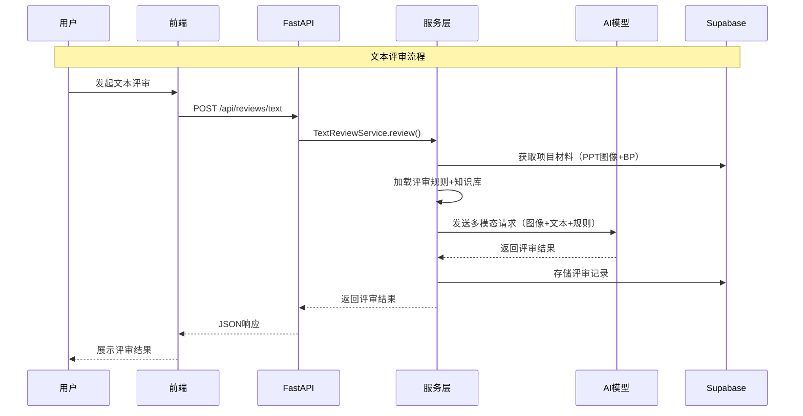

# 技术设计文档：中国大学生创新大赛评委系统

## 概述

本系统是一个面向中国大学生创新大赛的AI评委系统，部署在 `examples/web_ui_agent/` 目录下。系统提供两大核心功能：**AI文本评审**（基于多模态AI分析PPT和BP文档）和**现场路演AI评委**（基于Qwen Realtime模型的实时音视频交互）。

系统采用前后端分离架构：
- **后端**：Python FastAPI，使用 **uv** 作为包管理器和项目管理工具（通过 `pyproject.toml` + `uv.lock` 管理依赖，不使用 venv/pip），负责API路由、AI模型调用、文件处理和数据库交互
- **前端**：React + TypeScript，提供用户界面和GetStream视频通话集成
- **数据库**：Supabase（PostgreSQL + Auth + Storage）
- **AI模型**：Qwen Realtime（实时路演）+ 通义千问多模态模型（文本评审/离线评审）

### 设计决策

1. **选择Supabase而非自建数据库**：Supabase提供Auth、Storage、PostgreSQL一体化服务，减少基础设施复杂度，适合快速迭代
2. **评审规则以文件系统组织**：规则文件按 `{赛事}/{赛道}/{组别}/` 目录结构存放，便于管理员直接替换文件更新规则，无需数据库迁移
3. **知识库按材料类型分类**：知识库文件按 `bp/`、`text_ppt/`、`presentation_ppt/`、`presentation/` 分类，与四大核心材料对应，便于AI评审时精准加载相关经验
4. **PPT转图像预处理**：上传PPT后自动转为图像，避免每次评审时重复转换，同时便于多模态AI直接处理
5. **复用现有Vision Agents框架**：现场路演模块基于已有的Agent/AgentLauncher/Runner模式，保持与现有代码的一致性
6. **Prompt模板化管理**：将prompt拆分为固定结构（输出格式、评审流程）和动态片段（角色描述、评审规则、知识库、交互模式），通过模板引擎组装。这样在不同赛事/组别/风格条件下只需替换对应片段，无需维护大量完整prompt副本
7. **评委风格以配置文件管理**：每种风格对应一个独立的角色描述文件（Markdown），便于非开发人员编辑和扩展新风格
8. **音色管理分层设计**：预设音色直接通过Qwen-Omni-Realtime的`session.update`设置（零延迟），自定义音色通过`qwen-voice-enrollment`声音复刻API创建后存储voice标识。两种音色在前端统一展示，后端根据音色类型选择不同的语音输出路径
9. **使用 uv 管理后端项目**：后端使用 [uv](https://docs.astral.sh/uv/) 作为包管理器和项目运行工具，通过 `pyproject.toml` 声明依赖、`uv.lock` 锁定版本。所有命令（启动服务、运行测试等）统一使用 `uv run` 前缀执行（如 `uv run pytest`、`uv run uvicorn app.main:app`），不创建或依赖手动 venv

## 架构

### 系统架构图



### 项目目录结构

```
examples/web_ui_agent/
├── backend/
│   ├── app/
│   │   ├── __init__.py
│   │   ├── main.py                    # FastAPI 应用入口
│   │   ├── config.py                  # 配置管理
│   │   ├── routes/                    # 路由层
│   │   │   ├── auth.py
│   │   │   ├── projects.py
│   │   │   ├── materials.py
│   │   │   ├── reviews.py
│   │   │   ├── competitions.py
│   │   │   └── live_presentation.py
│   │   ├── services/                  # 服务层
│   │   │   ├── auth_service.py
│   │   │   ├── project_service.py
│   │   │   ├── material_service.py
│   │   │   ├── rule_service.py
│   │   │   ├── knowledge_service.py
│   │   │   ├── text_review_service.py
│   │   │   ├── live_presentation_service.py
│   │   │   ├── offline_review_service.py
│   │   │   ├── ppt_convert_service.py
│   │   │   ├── prompt_service.py
│   │   │   └── voice_service.py
│   │   ├── models/                    # 数据模型
│   │   │   ├── schemas.py             # Pydantic 请求/响应模型
│   │   │   └── database.py            # Supabase 客户端
│   │   └── utils/                     # 工具函数
│   │       ├── file_utils.py
│   │       └── ai_utils.py
│   ├── rules/                         # 评审规则文件
│   │   └── {赛事}/{赛道}/{组别}/
│   ├── knowledge/                     # 知识库文件
│   │   ├── bp/
│   │   ├── text_ppt/
│   │   ├── presentation_ppt/
│   │   └── presentation/
│   ├── prompts/                       # Prompt模板与评委风格
│   │   ├── templates/                 # 功能模板（固定结构部分）
│   │   │   ├── text_review.md         # 文本评审prompt模板
│   │   │   ├── live_presentation.md   # 现场路演prompt模板
│   │   │   └── offline_review.md      # 离线评审prompt模板
│   │   └── styles/                    # 评委风格（角色描述部分）
│   │       ├── strict.md              # 严厉型评委
│   │       ├── gentle.md              # 温和型评委
│   │       └── academic.md            # 学术型评委
│   ├── agent.py                       # 现场路演 Agent（基于Vision Agents）
│   ├── pyproject.toml
│   ├── uv.lock                        # uv 锁定文件（自动生成，提交到版本控制）
│   ├── Dockerfile
│   └── .env.example
├── frontend/                          # React + TypeScript 前端
│   ├── src/
│   │   ├── pages/
│   │   ├── components/
│   │   ├── services/
│   │   └── types/
│   ├── package.json
│   └── tsconfig.json
└── docker-compose.yml
```

### 请求流程



## 组件与接口

### 后端API接口

#### 认证接口
| 方法 | 路径 | 说明 |
|------|------|------|
| POST | `/api/auth/register` | 用户注册 |
| POST | `/api/auth/login` | 用户登录 |
| GET | `/api/auth/me` | 获取当前用户信息 |

#### 赛事配置接口
| 方法 | 路径 | 说明 |
|------|------|------|
| GET | `/api/competitions` | 获取赛事类型列表 |
| GET | `/api/competitions/{competition}/tracks` | 获取赛道列表 |
| GET | `/api/competitions/{competition}/tracks/{track}/groups` | 获取组别列表 |
| GET | `/api/competitions/{competition}/tracks/{track}/groups/{group}/rules` | 获取评审规则 |

#### 项目管理接口
| 方法 | 路径 | 说明 |
|------|------|------|
| POST | `/api/projects` | 创建项目 |
| GET | `/api/projects` | 获取用户项目列表 |
| GET | `/api/projects/{id}` | 获取项目详情 |
| PUT | `/api/projects/{id}` | 更新项目信息 |

#### 材料管理接口
| 方法 | 路径 | 说明 |
|------|------|------|
| POST | `/api/projects/{id}/materials` | 上传材料 |
| GET | `/api/projects/{id}/materials` | 获取项目材料列表 |
| GET | `/api/projects/{id}/materials/{type}` | 获取指定类型材料 |
| GET | `/api/projects/{id}/materials/{type}/versions` | 获取材料历史版本 |

#### 评审接口
| 方法 | 路径 | 说明 |
|------|------|------|
| POST | `/api/projects/{id}/reviews/text` | 发起文本评审 |
| POST | `/api/projects/{id}/reviews/offline` | 发起离线路演评审 |
| GET | `/api/projects/{id}/reviews` | 获取评审记录列表 |
| GET | `/api/projects/{id}/reviews/{review_id}` | 获取评审详情 |
| GET | `/api/projects/{id}/reviews/{review_id}/export` | 导出评审报告PDF |

#### 现场路演接口
| 方法 | 路径 | 说明 |
|------|------|------|
| POST | `/api/projects/{id}/live/start` | 创建路演会话 |
| POST | `/api/projects/{id}/live/mode` | 切换交互模式（提问/建议） |
| POST | `/api/projects/{id}/live/end` | 结束路演会话 |

#### Prompt与评委风格接口
| 方法 | 路径 | 说明 |
|------|------|------|
| GET | `/api/judge-styles` | 获取可用评委风格列表（id、名称、描述） |

#### 音色管理接口
| 方法 | 路径 | 说明 |
|------|------|------|
| GET | `/api/voices/presets` | 获取Qwen-Omni-Realtime预设音色列表 |
| GET | `/api/voices/custom` | 获取用户已创建的自定义音色列表 |
| POST | `/api/voices/clone` | 上传音频进行声音复刻，创建自定义音色 |
| DELETE | `/api/voices/custom/{voice_id}` | 删除用户的自定义音色 |

### 核心服务接口

```python
# rule_service.py
class RuleService:
    def load_rules(self, competition: str, track: str, group: str) -> EvaluationRules:
        """加载指定赛事/赛道/组别的评审规则"""
        ...
    
    def list_competitions(self) -> list[Competition]:
        """列出所有可用赛事"""
        ...
    
    def list_tracks(self, competition: str) -> list[Track]:
        """列出赛事下所有赛道"""
        ...
    
    def list_groups(self, competition: str, track: str) -> list[Group]:
        """列出赛道下所有组别"""
        ...
    
    def has_rules(self, competition: str, track: str, group: str) -> bool:
        """检查指定组合是否有对应规则文件"""
        ...

# knowledge_service.py
class KnowledgeService:
    def load_knowledge(self, material_type: str) -> str:
        """加载指定材料类型的知识库内容"""
        ...

# text_review_service.py
class TextReviewService:
    async def review(self, project_id: str, user_id: str) -> ReviewResult:
        """执行文本评审：获取材料→加载规则→调用AI→存储结果"""
        ...

# material_service.py
class MaterialService:
    async def upload(self, project_id: str, material_type: str, file: UploadFile) -> Material:
        """上传材料到Supabase Storage"""
        ...
    
    async def get_latest(self, project_id: str, material_type: str) -> Material | None:
        """获取指定类型的最新材料"""
        ...

# ppt_convert_service.py
class PPTConvertService:
    async def convert_to_images(self, file_path: str) -> list[str]:
        """将PPT文件转换为页面图像列表"""
        ...

# prompt_service.py
class PromptService:
    def list_styles(self) -> list[JudgeStyleInfo]:
        """列出所有可用评委风格（从 prompts/styles/ 目录读取）"""
        ...
    
    def load_style(self, style_id: str) -> str:
        """加载指定评委风格的角色描述内容"""
        ...
    
    def load_template(self, template_name: str) -> str:
        """加载指定功能的prompt模板（text_review/live_presentation/offline_review）"""
        ...
    
    def assemble_prompt(
        self,
        template_name: str,
        style_id: str,
        rules_content: str,
        knowledge_content: str,
        material_content: str,
        interaction_mode: str | None = None,
    ) -> str:
        """组装最终prompt，按顺序拼接：角色描述（含风格）→ 评审规则 → 知识库内容 → 材料内容 → 输出格式要求。
        现场路演时额外插入交互模式指令。"""
        ...

# voice_service.py
class VoiceService:
    def list_preset_voices(self) -> list[PresetVoiceInfo]:
        """列出Qwen-Omni-Realtime支持的所有预设音色"""
        ...
    
    async def clone_voice(self, user_id: str, audio_file: UploadFile, preferred_name: str) -> CustomVoiceInfo:
        """调用qwen-voice-enrollment API进行声音复刻，创建自定义音色并存储到数据库"""
        ...
    
    async def list_custom_voices(self, user_id: str) -> list[CustomVoiceInfo]:
        """列出用户已创建的自定义音色"""
        ...
    
    async def delete_custom_voice(self, user_id: str, voice_id: str) -> None:
        """删除用户的自定义音色（同时调用API删除和数据库删除）"""
        ...
    
    def get_voice_for_session(self, voice_id: str, voice_type: str) -> str:
        """根据音色类型返回用于session.update的voice参数值"""
        ...
```

### 前端核心组件

| 组件 | 说明 |
|------|------|
| `CompetitionSelector` | 赛事/赛道/组别三级联动选择器 |
| `MaterialCenter` | 材料中心，展示四大材料上传状态和操作 |
| `TextReviewPanel` | 文本评审结果展示面板（含雷达图） |
| `LivePresentation` | 现场路演页面，集成GetStream Video |
| `ModeSwitch` | 提问/建议模式切换组件 |
| `JudgeStyleSelector` | 评委风格选择器（严厉型/温和型/学术型） |
| `VoiceSelector` | AI评委音色选择器（预设音色+自定义音色） |
| `VoiceClonePanel` | 声音复刻面板（上传音频、录音指南、复刻状态） |
| `ReviewHistory` | 评审历史记录列表 |
| `ReviewDetail` | 评审详情页面 |
| `RadarChart` | 评分雷达图组件 |
| `ProjectDashboard` | 项目概览仪表盘 |


## 数据模型

### Supabase 数据库表设计

#### users 表（由 Supabase Auth 管理）

Supabase Auth 自动管理用户表，应用层通过 `auth.users` 访问。额外的用户信息存储在 `profiles` 表中。

```sql
CREATE TABLE profiles (
    id UUID PRIMARY KEY REFERENCES auth.users(id) ON DELETE CASCADE,
    display_name TEXT NOT NULL,
    created_at TIMESTAMPTZ DEFAULT NOW(),
    updated_at TIMESTAMPTZ DEFAULT NOW()
);
```

#### projects 表

```sql
CREATE TABLE projects (
    id UUID PRIMARY KEY DEFAULT gen_random_uuid(),
    user_id UUID NOT NULL REFERENCES auth.users(id) ON DELETE CASCADE,
    name TEXT NOT NULL,
    competition TEXT NOT NULL,        -- 赛事类型: guochuangsai, datiao, xiaotiao
    track TEXT NOT NULL,              -- 赛道
    "group" TEXT NOT NULL,            -- 组别
    current_stage TEXT DEFAULT 'school_text',  -- 当前比赛阶段
    created_at TIMESTAMPTZ DEFAULT NOW(),
    updated_at TIMESTAMPTZ DEFAULT NOW()
);
```

`current_stage` 枚举值：
- `school_text` - 校赛文本评审
- `school_presentation` - 校赛路演
- `province_text` - 省赛文本评审
- `province_presentation` - 省赛路演
- `national_text` - 国赛文本评审
- `national_presentation` - 国赛路演

#### project_materials 表

```sql
CREATE TABLE project_materials (
    id UUID PRIMARY KEY DEFAULT gen_random_uuid(),
    project_id UUID NOT NULL REFERENCES projects(id) ON DELETE CASCADE,
    material_type TEXT NOT NULL,       -- bp, text_ppt, presentation_ppt, presentation_video
    file_path TEXT NOT NULL,           -- Supabase Storage 路径
    file_name TEXT NOT NULL,
    file_size BIGINT NOT NULL,
    version INTEGER NOT NULL DEFAULT 1,
    image_paths JSONB,                 -- PPT转换后的图像路径列表（仅PPT类型）
    is_latest BOOLEAN DEFAULT TRUE,
    created_at TIMESTAMPTZ DEFAULT NOW()
);

CREATE INDEX idx_materials_project_type ON project_materials(project_id, material_type, is_latest);
```

#### reviews 表

```sql
CREATE TABLE reviews (
    id UUID PRIMARY KEY DEFAULT gen_random_uuid(),
    project_id UUID NOT NULL REFERENCES projects(id) ON DELETE CASCADE,
    user_id UUID NOT NULL REFERENCES auth.users(id),
    review_type TEXT NOT NULL,         -- text_review, live_presentation, offline_presentation
    competition TEXT NOT NULL,
    track TEXT NOT NULL,
    "group" TEXT NOT NULL,
    stage TEXT NOT NULL,               -- 对应的比赛阶段
    judge_style TEXT DEFAULT 'strict', -- 评委风格: strict, gentle, academic
    total_score NUMERIC(5,2),
    material_versions JSONB,           -- 使用的材料版本信息 {"text_ppt": 3, "bp": 2}
    status TEXT DEFAULT 'pending',     -- pending, processing, completed, failed
    error_message TEXT,
    created_at TIMESTAMPTZ DEFAULT NOW(),
    completed_at TIMESTAMPTZ
);

CREATE INDEX idx_reviews_project ON reviews(project_id, created_at DESC);
```

#### custom_voices 表

```sql
CREATE TABLE custom_voices (
    id UUID PRIMARY KEY DEFAULT gen_random_uuid(),
    user_id UUID NOT NULL REFERENCES auth.users(id) ON DELETE CASCADE,
    voice TEXT NOT NULL,               -- 声音复刻API返回的voice标识
    preferred_name TEXT NOT NULL,      -- 用户指定的音色名称
    target_model TEXT NOT NULL,        -- 驱动音色的TTS模型（如 qwen3-tts-vc-realtime-2026-01-15）
    created_at TIMESTAMPTZ DEFAULT NOW()
);

CREATE INDEX idx_custom_voices_user ON custom_voices(user_id);
```

#### review_details 表

```sql
CREATE TABLE review_details (
    id UUID PRIMARY KEY DEFAULT gen_random_uuid(),
    review_id UUID NOT NULL REFERENCES reviews(id) ON DELETE CASCADE,
    dimension TEXT NOT NULL,            -- 评审维度名称（如"个人成长"、"项目创新"）
    max_score NUMERIC(5,2) NOT NULL,   -- 该维度满分
    score NUMERIC(5,2) NOT NULL,       -- 得分
    sub_items JSONB,                   -- 子项评价 [{"name": "立德树人", "comment": "..."}]
    suggestions JSONB,                 -- 改进建议列表 ["建议1", "建议2"]
    created_at TIMESTAMPTZ DEFAULT NOW()
);

CREATE INDEX idx_review_details_review ON review_details(review_id);
```

### Pydantic 数据模型

```python
from pydantic import BaseModel
from datetime import datetime
from typing import Optional

class EvaluationDimension(BaseModel):
    name: str                    # 维度名称
    max_score: float             # 满分
    sub_items: list[str]         # 子项列表

class EvaluationRules(BaseModel):
    competition: str
    track: str
    group: str
    dimensions: list[EvaluationDimension]
    raw_content: str             # 原始规则文本

class MaterialUploadResponse(BaseModel):
    id: str
    material_type: str
    file_name: str
    version: int
    created_at: datetime

class ReviewRequest(BaseModel):
    stage: str                   # 当前比赛阶段
    judge_style: str = "strict"  # 评委风格: strict, gentle, academic

class DimensionScore(BaseModel):
    dimension: str
    max_score: float
    score: float
    sub_items: list[dict]        # [{"name": "...", "comment": "..."}]
    suggestions: list[str]

class ReviewResult(BaseModel):
    id: str
    review_type: str
    total_score: float
    dimensions: list[DimensionScore]
    overall_suggestions: list[str]
    status: str
    created_at: datetime

class CompetitionInfo(BaseModel):
    id: str
    name: str

class TrackInfo(BaseModel):
    id: str
    name: str

class GroupInfo(BaseModel):
    id: str
    name: str
    has_rules: bool

class ProjectCreate(BaseModel):
    name: str
    competition: str
    track: str
    group: str

class ProjectResponse(BaseModel):
    id: str
    name: str
    competition: str
    track: str
    group: str
    current_stage: str
    materials_status: dict       # {"bp": bool, "text_ppt": bool, ...}
    created_at: datetime

class LiveSessionCreate(BaseModel):
    mode: str = "question"       # question 或 suggestion
    style: str = "strict"        # 评委风格: strict, gentle, academic
    voice: str = "Cherry"        # 音色: 预设音色名或自定义音色ID
    voice_type: str = "preset"   # preset 或 custom

class ModeSwitch(BaseModel):
    mode: str                    # question 或 suggestion

class JudgeStyleInfo(BaseModel):
    id: str                      # 风格标识: strict, gentle, academic
    name: str                    # 显示名称: 严厉型, 温和型, 学术型
    description: str             # 风格简介

class PresetVoiceInfo(BaseModel):
    voice: str                   # 音色参数值: Cherry, Ethan, Serena 等
    name: str                    # 中文名称: 芊悦, 晨煦, 苏瑶 等
    description: str             # 音色描述
    languages: list[str]         # 支持的语种

class CustomVoiceInfo(BaseModel):
    id: str                      # 数据库记录ID
    voice: str                   # 声音复刻API返回的voice标识
    preferred_name: str          # 用户指定的音色名称
    target_model: str            # 驱动音色的TTS模型
    created_at: datetime
```

### Supabase Storage Bucket 结构

```
materials/
├── {project_id}/
│   ├── bp/
│   │   └── v{version}_{filename}
│   ├── text_ppt/
│   │   ├── v{version}_{filename}
│   │   └── images/
│   │       ├── page_001.png
│   │       └── page_002.png
│   ├── presentation_ppt/
│   │   ├── v{version}_{filename}
│   │   └── images/
│   │       └── ...
│   └── presentation_video/
│       └── v{version}_{filename}
reports/
├── {review_id}.pdf
```

### 评审规则文件目录结构

```
rules/
├── guochuangsai/                    # 国创赛
│   ├── gaojiao/                     # 高教主赛道
│   │   ├── benke_chuangyi/          # 本科创意组
│   │   │   └── rules.md
│   │   ├── benke_chuangye/          # 本科创业组
│   │   │   └── rules.md
│   │   ├── yanjiusheng_chuangyi/    # 研究生创意组
│   │   │   └── rules.md
│   │   └── yanjiusheng_chuangye/    # 研究生创业组
│   │       └── rules.md
│   ├── honglv/                      # 红旅赛道
│   │   ├── gongyi/                  # 公益组
│   │   ├── chuangyi/                # 创意组
│   │   └── chuangye/                # 创业组
│   ├── zhijiao/                     # 职教赛道
│   ├── chanye/                      # 产业命题赛道
│   └── mengya/                      # 萌芽赛道
├── datiao/                          # 大挑
└── xiaotiao/                        # 小挑
```


## 正确性属性

*正确性属性是指在系统所有有效执行中都应保持为真的特征或行为——本质上是关于系统应该做什么的形式化声明。属性是人类可读规范与机器可验证正确性保证之间的桥梁。*

### 属性 1：赛事级联选择一致性

*对于任意*有效的赛事类型，查询其赛道列表应返回非空结果；*对于任意*有效的赛事+赛道组合，查询其组别列表应返回非空结果；*对于任意*有效的赛事+赛道+组别组合且存在规则文件时，加载规则应返回包含评审维度的规则对象。

**验证需求: 1.2, 1.3, 1.4**

### 属性 2：无规则组合的错误处理

*对于任意*不存在对应规则文件的赛事/赛道/组别组合，调用规则加载服务应返回明确的错误信息而非空结果或异常崩溃。

**验证需求: 1.5**

### 属性 3：评审规则路径构造正确性

*对于任意*赛事类型、赛道和组别的组合，规则服务构造的文件路径应严格遵循 `rules/{赛事}/{赛道}/{组别}/` 的格式。

**验证需求: 2.3**

### 属性 4：评审规则维度完整性

*对于任意*成功加载的评审规则，其所有维度的满分之和应等于100分，且每个维度的满分值大于0。

**验证需求: 2.4**

### 属性 5：评审Prompt组装完整性

*对于任意*评审请求（文本评审或路演评审），构造的AI Prompt应同时包含评审规则内容和对应材料类型的知识库内容。

**验证需求: 2.8, 2.6**


### 属性 6：文件格式与大小验证

*对于任意*上传请求，系统应根据材料类型验证文件扩展名（BP接受.docx/.pdf，PPT接受.pptx/.pdf，视频接受.mp4/.webm），且PPT/BP文件超过50MB或视频文件超过500MB时应拒绝上传。

**验证需求: 3.2, 3.7, 3.8**

### 属性 7：材料版本管理一致性

*对于任意*项目和材料类型，连续上传N个版本后，系统应保留所有N个版本记录，且仅最新版本的 `is_latest` 标记为 `true`，其余为 `false`。

**验证需求: 3.3, 3.4**

### 属性 8：PPT转图像完整性

*对于任意*上传的PPT文件，转换后生成的图像数量应等于PPT的页数，且每张图像文件应为有效的图像格式。

**验证需求: 3.9**

### 属性 9：评审结果使用最新材料

*对于任意*评审请求（文本评审、离线路演评审或现场路演），系统应使用项目材料中心中对应类型的最新版本材料。

**验证需求: 4.1, 6.3, 8.1**

### 属性 10：评审结果结构符合规则

*对于任意*完成的评审结果，其评分维度应与所选赛道/组别的评审规则维度一一对应，每个维度的得分不超过该维度的满分值，且每个维度包含非空的子项评价和改进建议。

**验证需求: 4.3, 4.4, 4.5**


### 属性 11：评审结果持久化往返

*对于任意*评审结果，存储到数据库后再查询，返回的评审记录应包含完整的评分、评价和建议信息，且与原始结果一致。

**验证需求: 4.6**

### 属性 12：路演交互模式指令差异性

*对于任意*交互模式切换，提问模式下的AI指令应包含"提问"相关指示词，建议模式下的AI指令应包含"建议"相关指示词，且两种模式的指令内容不同。

**验证需求: 7.2, 7.3**

### 属性 13：离线评审报告完整性

*对于任意*完成的离线路演评审结果，报告应包含四个必要部分：演讲表现评价、PPT内容评价、综合评分和改进建议，且每个部分非空。

**验证需求: 8.3, 8.4**

### 属性 14：项目创建字段验证

*对于任意*项目创建请求，缺少项目名称、赛事类型、赛道或组别中任一必填字段时，系统应拒绝创建并返回验证错误。

**验证需求: 9.3**

### 属性 15：项目与评审记录的CRUD一致性

*对于任意*用户，创建多个项目后应能查询到所有项目；*对于任意*项目，执行多次评审后应能查询到所有历史评审记录及其详细内容。

**验证需求: 9.2, 9.5, 9.6**

### 属性 16：项目数据持久化往返

*对于任意*创建的项目，存储到数据库后查询，返回的赛事类型、赛道、组别和比赛阶段信息应与创建时一致。

**验证需求: 12.3**

### 属性 17：评审记录类型与材料版本关联

*对于任意*评审记录，其 `review_type` 应为 `text_review`、`live_presentation` 或 `offline_presentation` 之一，且 `material_versions` 字段应正确记录评审时使用的各材料版本号。

**验证需求: 12.5**

### 属性 18：Prompt模板组装顺序正确性

*对于任意*评审请求或现场路演会话，组装后的最终prompt中各片段的出现顺序应严格遵循：角色描述（含风格）→ 评审规则 → 知识库内容 → 材料内容 → 输出格式要求。即角色描述的位置在评审规则之前，评审规则在知识库内容之前，知识库内容在材料内容之前，材料内容在输出格式要求之前。

**验证需求: 13.6**

### 属性 19：评委风格切换有效性

*对于任意*两种不同的评委风格（如严厉型与温和型），使用相同的评审规则、知识库和材料内容组装prompt时，最终prompt中的角色描述部分应不同。

**验证需求: 13.3, 13.5**

### 属性 20：交互模式与评委风格独立性

*对于任意*现场路演会话中的交互模式切换（提问↔建议），切换前后的prompt中角色描述部分和评审规则部分应保持完全一致，仅交互模式指令部分发生变化。

**验证需求: 13.7**


### 属性 21：预设音色设置正确性

*对于任意*现场路演会话创建请求中指定的预设音色，系统发送给Qwen-Omni-Realtime的 `session.update` 事件中的 `voice` 参数值应与用户选择的音色一致。

**验证需求: 14.3**

### 属性 22：声音复刻音频验证

*对于任意*声音复刻请求，系统应验证上传音频的格式（WAV/MP3/M4A）、文件大小（<10MB）和时长（10~60秒），不满足条件时应拒绝并返回具体错误信息。

**验证需求: 14.4, 14.9**


## 错误处理

### 错误分类与处理策略

| 错误类型 | 触发条件 | 处理方式 | HTTP状态码 |
|----------|----------|----------|------------|
| 认证错误 | Token无效或过期 | 返回401，前端跳转登录页 | 401 |
| 权限错误 | 用户访问非自己的项目 | 返回403 | 403 |
| 资源不存在 | 项目/评审记录不存在 | 返回404 | 404 |
| 参数验证错误 | 缺少必填字段、格式错误 | 返回422，包含字段级错误信息 | 422 |
| 文件格式错误 | 上传不支持的文件格式 | 返回400，提示支持的格式 | 400 |
| 文件过大 | PPT/BP>50MB 或 视频>500MB | 返回413，提示大小限制 | 413 |
| 材料缺失 | 评审时必需材料未上传 | 返回400，提示需要上传的材料 | 400 |
| 规则文件缺失 | 所选组合无对应规则 | 返回404，建议选择其他组合 | 404 |
| AI API调用失败 | DashScope API超时或错误 | 记录日志，返回503，提示稍后重试 | 503 |
| PPT转换失败 | LibreOffice转换异常 | 记录日志，返回500，提示重新上传 | 500 |
| 声音复刻失败 | 音频质量不达标或API错误 | 返回具体错误信息，建议参考录音指南 | 400/503 |
| 音色不存在 | 指定的自定义音色已被删除或过期 | 返回404，建议选择预设音色 | 404 |
| 数据库错误 | Supabase连接或查询失败 | 记录日志，返回500 | 500 |

### 统一错误响应格式

```python
class ErrorResponse(BaseModel):
    error: str          # 错误类型标识
    message: str        # 用户可读的中文错误信息
    details: dict | None = None  # 可选的详细信息（如字段验证错误）
```

### AI API 重试策略

- 文本评审和离线评审的AI调用失败时，自动重试最多2次，间隔2秒
- 现场路演的实时连接断开时，尝试自动重连，超过3次失败后通知用户
- 所有AI调用设置30秒超时（文本评审）和60秒超时（离线视频评审）


## 测试策略

### 双重测试方法

本系统采用单元测试与属性测试相结合的方式，确保全面的测试覆盖：

- **单元测试**：验证具体示例、边界情况和错误条件
- **属性测试**：验证在所有输入上都成立的通用属性

两者互补：单元测试捕获具体的bug，属性测试验证通用的正确性。

### 属性测试配置

- **包管理与运行**：使用 `uv run` 执行所有测试命令（如 `uv run --project examples/web_ui_agent/backend pytest`），不使用 venv/pip
- **测试库**：使用 `hypothesis` 作为Python属性测试库
- **最小迭代次数**：每个属性测试至少运行100次
- **标签格式**：每个测试用注释标注对应的设计属性
  - 格式：`Feature: competition-judge-system, Property {number}: {property_text}`
- **每个正确性属性由一个属性测试实现**

### 单元测试范围

单元测试聚焦于以下场景：

1. **具体示例**：
   - 国创赛高教主赛道本科创意组的规则加载（验证具体维度和分值）
   - 上传一个具体的PPT文件并验证转换结果

2. **边界情况**：
   - 上传恰好50MB的PPT文件（应接受）
   - 上传50.1MB的PPT文件（应拒绝）
   - 空文件上传
   - 项目无任何材料时发起评审

3. **错误条件**：
   - AI API返回超时
   - Supabase连接失败
   - 上传不支持的文件格式
   - 未认证用户访问受保护接口

4. **集成测试**：
   - 完整的文本评审流程（上传→评审→查询结果）
   - 项目创建→材料上传→评审→导出的端到端流程

### 属性测试范围

每个正确性属性对应一个属性测试，使用 `hypothesis` 生成随机输入：

| 属性编号 | 测试描述 | 生成器策略 |
|----------|----------|------------|
| 属性1 | 级联选择一致性 | 随机生成有效的赛事/赛道/组别组合 |
| 属性2 | 无规则组合错误处理 | 随机生成不存在规则的组合 |
| 属性3 | 路径构造正确性 | 随机生成赛事/赛道/组别字符串 |
| 属性4 | 维度满分之和 | 从所有规则文件中随机选取 |
| 属性5 | Prompt组装完整性 | 随机生成评审请求参数 |
| 属性6 | 文件格式与大小验证 | 随机生成文件名和大小 |
| 属性7 | 版本管理一致性 | 随机生成上传序列 |
| 属性8 | PPT转图像完整性 | 随机生成不同页数的PPT |
| 属性9 | 使用最新材料 | 随机生成多版本材料序列 |
| 属性10 | 评审结果结构符合规则 | 随机生成评审结果并验证结构 |
| 属性11 | 评审结果持久化往返 | 随机生成评审结果数据 |
| 属性12 | 模式指令差异性 | 随机切换模式并验证指令 |
| 属性13 | 离线评审报告完整性 | 随机生成离线评审结果 |
| 属性14 | 项目创建字段验证 | 随机省略必填字段 |
| 属性15 | CRUD一致性 | 随机生成项目和评审序列 |
| 属性16 | 项目数据持久化往返 | 随机生成项目数据 |
| 属性17 | 评审记录类型与版本关联 | 随机生成不同类型的评审记录 |
| 属性18 | Prompt模板组装顺序正确性 | 随机生成各片段内容，验证组装后顺序 |
| 属性19 | 评委风格切换有效性 | 随机选取两种不同风格，验证角色描述差异 |
| 属性20 | 交互模式与评委风格独立性 | 随机生成路演会话，切换模式后验证角色描述和规则不变 |
| 属性21 | 预设音色设置正确性 | 随机选取预设音色，验证session.update参数一致 |
| 属性22 | 声音复刻音频验证 | 随机生成不同格式、大小、时长的音频文件 |

### 测试目录结构

```
backend/
├── tests/
│   ├── conftest.py              # 测试fixtures和Supabase mock
│   ├── test_rule_service.py     # 规则服务单元测试+属性测试
│   ├── test_knowledge_service.py
│   ├── test_material_service.py # 材料服务单元测试+属性测试
│   ├── test_text_review.py      # 文本评审单元测试+属性测试
│   ├── test_offline_review.py
│   ├── test_project_service.py
│   ├── test_live_presentation.py
│   ├── test_prompt_service.py   # Prompt模板服务单元测试+属性测试
│   ├── test_voice_service.py    # 音色管理服务单元测试+属性测试
│   └── test_api/                # API集成测试
│       ├── test_auth_routes.py
│       ├── test_project_routes.py
│       └── test_review_routes.py
```
