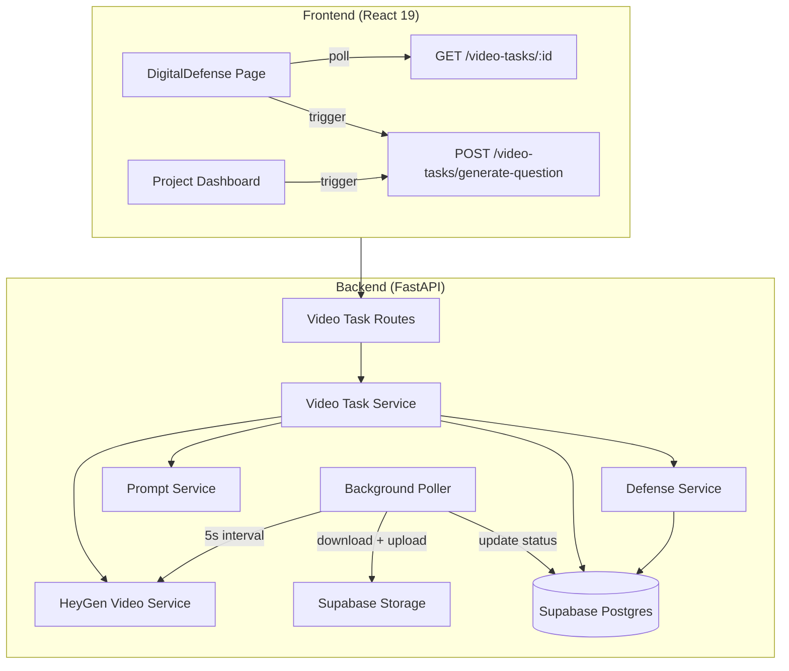
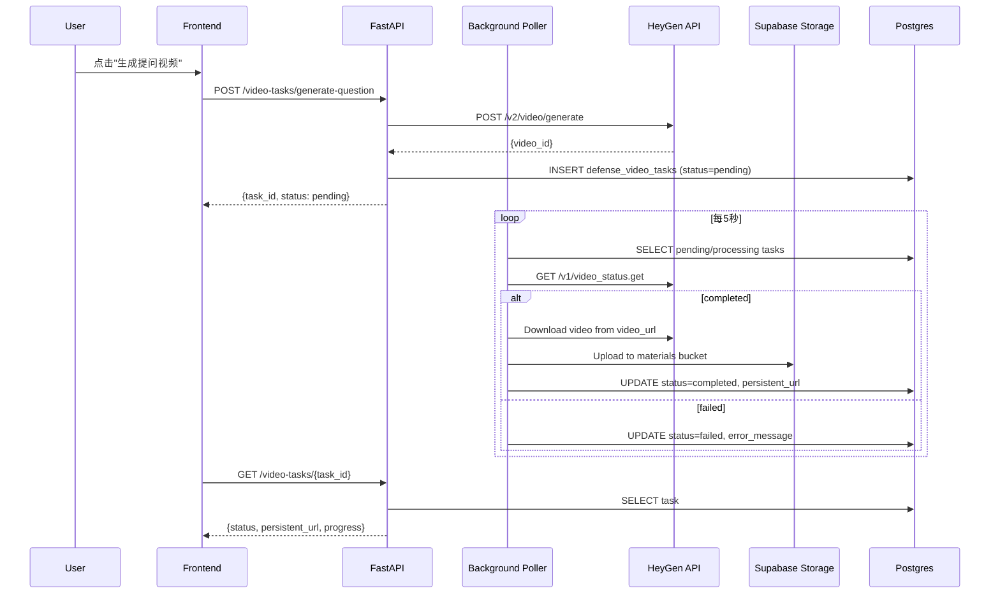

# Design Document: Defense Video Persistence

## Overview

本设计为数字人问辩系统增加视频持久化与异步生成能力。核心变更包括：

1. 新增 `defense_video_tasks` 表追踪每次 HeyGen 视频生成任务的状态与持久化 URL
2. 扩展 `defense_records` 表关联视频任务并记录反馈类型
3. 后端引入 asyncio 后台轮询任务，自动将 HeyGen 临时 URL 下载并上传至 Supabase Storage
4. 前端通过轮询 API 获取视频任务状态，支持跨页面导航后恢复进度
5. 新增预生成提问视频流程、反馈类型选择、历史视频回放、题目侧边栏显示
6. Prompt 模板迁移至文件系统统一管理

### 关键设计决策

- **后端轮询而非前端轮询 HeyGen**：将 HeyGen API 轮询移至后端 background task，前端只轮询本系统 API。这样即使用户关闭页面，视频生成仍会完成并持久化。
- **下载+上传双步持久化**：HeyGen video_url 7天过期，完成后立即下载视频文件并上传至 Supabase Storage `materials` bucket 获取永久 URL。
- **"outdated" 标记而非自动删除**：问题修改后仅标记已有预生成视频为 outdated，不自动删除，用户可选择重新生成。
- **反馈类型由用户选择**：回答完成后弹窗让用户选择文本或视频反馈，而非自动决定。
- **Prompt 模板运行时加载**：每次调用时从文件系统读取，无需重启服务器即可更新。

## Architecture



### 后端轮询流程



## Components and Interfaces

### 1. Video Task Service (`backend/app/services/video_task_service.py`)

新增服务，负责视频任务的创建、查询和状态管理。

```python
class VideoTaskService:
    """视频任务管理服务。"""
    
    async def create_question_video_task(
        self, project_id: str, user_id: str, questions: list[dict]
    ) -> dict:
        """创建提问视频生成任务。
        - 组装提问话术文本（通过 prompt 模板）
        - 调用 HeyGen API 提交生成请求
        - 创建 defense_video_tasks 记录
        - 启动后台轮询
        """
    
    async def create_feedback_video_task(
        self, project_id: str, user_id: str, 
        defense_record_id: str, feedback_text: str
    ) -> dict:
        """创建反馈视频生成任务。"""
    
    async def get_task(self, task_id: str) -> dict | None:
        """查询单个视频任务状态。"""
    
    async def get_latest_question_task(self, project_id: str) -> dict | None:
        """获取项目最新的提问视频任务。"""
    
    async def mark_outdated(self, project_id: str) -> None:
        """将项目所有 completed 状态的 question 类型任务标记为 outdated。"""
    
    async def check_has_active_task(self, project_id: str) -> bool:
        """检查项目是否有 pending/processing 状态的任务。"""
```

### 2. Background Poller (`backend/app/services/video_task_poller.py`)

后台轮询服务，作为 FastAPI lifespan 中的 asyncio task 运行。

```python
class VideoTaskPoller:
    """后台视频任务轮询器。"""
    
    async def start(self) -> None:
        """启动轮询循环。"""
    
    async def stop(self) -> None:
        """停止轮询循环。"""
    
    async def poll_once(self) -> None:
        """执行一次轮询：
        1. 查询所有 pending/processing 状态的任务
        2. 对每个任务调用 HeyGen status API
        3. 如果 completed：下载视频 → 上传 Supabase Storage → 更新记录
        4. 如果 failed：更新记录状态和错误信息
        """
    
    async def _persist_video(self, task: dict, video_url: str) -> str:
        """下载 HeyGen 视频并上传至 Supabase Storage，返回 persistent_url。"""
```

### 3. Video Task Routes (`backend/app/routes/defense.py` 扩展)

在现有 defense 路由中新增视频任务相关端点：

| Method | Path | Description |
|--------|------|-------------|
| POST | `/defense/video-tasks/generate-question` | 创建提问视频生成任务 |
| POST | `/defense/video-tasks/generate-feedback` | 创建反馈视频生成任务 |
| GET | `/defense/video-tasks/{task_id}` | 查询视频任务状态 |
| GET | `/defense/video-tasks/latest-question` | 获取最新提问视频任务 |

### 4. Prompt Template Files (`backend/prompts/templates/defense/`)

新增目录结构：

```
backend/prompts/templates/defense/
├── question_gen.md      # 问题生成 system prompt
├── feedback_gen.md      # 反馈生成 system prompt
└── question_speech.md   # 提问话术模板（含变量占位符）
```

`question_speech.md` 模板示例：
```markdown
你好，我是数字人评委，对于你们的{{project_name}}项目，我有以下{{question_count}}个问题：{{questions_text}}
```

### 5. Frontend Components

#### DigitalDefense Page 变更

- 新增 `QuestionPanel` 组件：响应式题目侧边栏
- 新增 `FeedbackTypeModal` 组件：反馈类型选择弹窗
- 新增 `VideoTaskStatus` 组件：视频任务状态显示（进度条 + 标签）
- 修改历史记录列表：增加视频回放按钮和状态标签
- 新增预生成按钮逻辑

#### 状态管理

前端通过 `setInterval` 轮询 `GET /video-tasks/{task_id}` 端点（5秒间隔），在组件 mount 时检查是否有进行中的任务并恢复显示。使用 React state + useEffect 管理，无需引入额外状态管理库。

### 6. HeyGen Video Service 变更

扩展 `heygen_video_service.py` 的 `generate_video` 方法，支持：
- `caption: true` 参数启用字幕
- `talking_style: "expressive"` 参数（talking_photo 类型时）
- 这些参数通过 `Settings` 配置，可通过环境变量覆盖

### 7. Defense Service 变更

- `submit_answer` 方法新增 `feedback_type` 参数
- `_insert_record` 方法新增 `feedback_type`、`question_video_task_id`、`feedback_video_task_id` 字段
- 问题 CRUD 操作后触发 `mark_outdated` 检查
- Prompt 文本从硬编码改为通过 `PromptService` 从文件加载

## Data Models

### 新增表：`defense_video_tasks`

```sql
CREATE TABLE defense_video_tasks (
    id UUID PRIMARY KEY DEFAULT gen_random_uuid(),
    project_id UUID NOT NULL REFERENCES projects(id) ON DELETE CASCADE,
    user_id UUID NOT NULL REFERENCES auth.users(id),
    video_type TEXT NOT NULL CHECK (video_type IN ('question', 'feedback')),
    heygen_video_id TEXT NOT NULL,
    status TEXT NOT NULL DEFAULT 'pending' 
        CHECK (status IN ('pending', 'processing', 'completed', 'failed', 'outdated')),
    persistent_url TEXT,
    heygen_video_url TEXT,
    error_message TEXT,
    questions_hash TEXT,  -- MD5 of questions content, for outdated detection
    defense_record_id UUID REFERENCES defense_records(id),  -- for feedback type
    created_at TIMESTAMPTZ NOT NULL DEFAULT now(),
    updated_at TIMESTAMPTZ NOT NULL DEFAULT now()
);

CREATE INDEX idx_dvt_project_id ON defense_video_tasks(project_id);
CREATE INDEX idx_dvt_status ON defense_video_tasks(status) 
    WHERE status IN ('pending', 'processing');
```

### 扩展表：`defense_records` 新增列

```sql
ALTER TABLE defense_records 
    ADD COLUMN feedback_type TEXT DEFAULT 'text' CHECK (feedback_type IN ('text', 'video')),
    ADD COLUMN question_video_task_id UUID REFERENCES defense_video_tasks(id),
    ADD COLUMN feedback_video_task_id UUID REFERENCES defense_video_tasks(id);
```

### 新增 Pydantic Schemas

```python
class VideoTaskResponse(BaseModel):
    id: str
    project_id: str
    video_type: str  # "question" | "feedback"
    status: str  # "pending" | "processing" | "completed" | "failed" | "outdated"
    persistent_url: str | None = None
    error_message: str | None = None
    created_at: datetime
    updated_at: datetime

class GenerateQuestionVideoRequest(BaseModel):
    pass  # uses current project questions

class GenerateFeedbackVideoRequest(BaseModel):
    defense_record_id: str
    feedback_text: str
```

### 扩展 TypeScript Types

```typescript
export interface VideoTask {
    id: string;
    project_id: string;
    video_type: 'question' | 'feedback';
    status: 'pending' | 'processing' | 'completed' | 'failed' | 'outdated';
    persistent_url: string | null;
    error_message: string | null;
    created_at: string;
    updated_at: string;
}

export interface DefenseRecord {
    // ... existing fields ...
    feedback_type: 'text' | 'video';
    question_video_task_id: string | null;
    feedback_video_task_id: string | null;
}
```

### Settings 扩展

```python
# backend/app/config.py 新增
heygen_video_caption: bool = True
heygen_video_talking_style: str = "expressive"
```


## Correctness Properties

*A property is a characteristic or behavior that should hold true across all valid executions of a system — essentially, a formal statement about what the system should do. Properties serve as the bridge between human-readable specifications and machine-verifiable correctness guarantees.*

### Property 1: Video task creation preserves all required fields

*For any* valid project_id, video_type ("question" or "feedback"), and HeyGen video_id, creating a Video_Task record should produce a record containing the exact project_id, video_type, heygen_video_id, and status "pending" that were provided.

**Validates: Requirements 1.1, 2.1**

### Property 2: Completed video persistence produces valid persistent URL

*For any* Video_Task with status transitioning to "completed" and a non-empty HeyGen video_url, after the persist operation the task record should have status "completed", a non-null persistent_url pointing to Supabase Storage, and the heygen_video_url stored for reference.

**Validates: Requirements 1.2**

### Property 3: Failed video task records error information

*For any* Video_Task that receives a "failed" status from HeyGen API, the task record should be updated to status "failed" with a non-empty error_message string.

**Validates: Requirements 1.3**

### Property 4: Defense record feedback type consistency

*For any* Defense_Record, feedback_type is "text" if and only if feedback_video_task_id is null, and feedback_type is "video" if and only if feedback_video_task_id is non-null.

**Validates: Requirements 1.4, 5.2, 5.3**

### Property 5: Polling endpoint returns correct task state

*For any* Video_Task ID that exists in the database, the polling endpoint should return the current status and, when status is "completed", a non-null persistent_url.

**Validates: Requirements 2.3**

### Property 6: Pre-generate button visibility logic

*For any* combination of question count and avatar provider, the "生成提问视频" button should be visible if and only if question count > 0 AND provider is "heygen".

**Validates: Requirements 3.1**

### Property 7: Question hash change detection for outdated marking

*For any* two distinct question sets (differing in content or order), their computed hashes should differ. For any identical question sets, their hashes should be equal. When a question is modified after a video task is created, the task should be marked "outdated".

**Validates: Requirements 3.4**

### Property 8: Active task prevents duplicate generation

*For any* project with a Video_Task in "pending" or "processing" status, the `check_has_active_task` function should return true, and the generate button should be disabled.

**Validates: Requirements 3.5**

### Property 9: Video task status tag rendering

*For any* Video_Task, the displayed status tag should correctly reflect the task's status: "failed" → red "视频生成失败" tag, "pending"/"processing" → blue "生成中" tag, and a record with null/empty persistent_url → "视频不可用" warning.

**Validates: Requirements 6.1, 6.2, 6.3**

### Property 10: Video playback button visibility

*For any* Defense_Record with an associated Video_Task (question or feedback) that has a valid non-null persistent_url, a corresponding playback button should be displayed. If persistent_url is null or empty, no playback button should appear.

**Validates: Requirements 7.1, 7.2**

### Property 11: Question panel displays all questions with sequence numbers

*For any* list of defense questions during the "speaking" or "recording" phase, the question panel should render each question with its sequence number (e.g., "问题1") and full content text, and the total count of rendered items should equal the input question count.

**Validates: Requirements 8.1, 8.2**

### Property 12: HeyGen payload includes configured caption and talking_style

*For any* video generation request, the constructed HeyGen API payload should include `caption` set to the configured value (default true). When the character type is "talking_photo", the payload should additionally include `talking_style` set to the configured value (default "expressive"). These values should come from Settings, not hardcoded.

**Validates: Requirements 9.1, 9.2, 9.3**

### Property 13: Prompt template runtime loading round-trip

*For any* prompt template name in {"question_gen", "feedback_gen", "question_speech"}, if the corresponding file exists at `backend/prompts/templates/defense/{name}.md`, loading should return the current file content. If the file does not exist, loading should return a non-empty hardcoded default. Writing new content to the file and immediately loading should return the new content.

**Validates: Requirements 10.4, 10.5**

### Property 14: Questions speech text formatting

*For any* project name and non-empty list of questions, the formatted speech text should contain the project name, the question count, and every question's content text in order.

**Validates: Requirements 3.2**

## Error Handling

### Backend Errors

| Scenario | Handling |
|----------|----------|
| HeyGen API key not configured | Return 503 with "HeyGen API Key 未配置" |
| HeyGen generate API failure | Return 502, do NOT create video task record |
| HeyGen status poll network error | Log warning, retry on next poll cycle (5s) |
| Video download failure | Set task status to "failed" with error "视频下载失败" |
| Supabase Storage upload failure | Set task status to "failed" with error "视频上传失败" |
| Task not found | Return 404 |
| Duplicate active task | Return 409 with "已有视频正在生成中" |
| Prompt template file missing | Fall back to hardcoded default, log warning |
| STT transcription failure | Set defense_record status to "failed", return 502 |

### Frontend Errors

| Scenario | Handling |
|----------|----------|
| Polling endpoint returns error | Show warning toast, continue polling |
| Video playback fails (URL expired) | Show "视频链接已失效" message, hide play button |
| Generate request fails | Show error toast, re-enable generate button |
| Network disconnection during polling | Continue polling attempts, show offline indicator |

### Background Poller Resilience

- Individual task poll failures do not affect other tasks in the same cycle
- Poller catches all exceptions per-task and logs them
- If Supabase connection is lost, poller continues running and retries next cycle
- Maximum poll attempts per task: 720 (1 hour at 5s intervals), then mark as "failed" with timeout error

## Testing Strategy

### Unit Tests

Unit tests focus on specific examples, edge cases, and integration points:

- Video task creation with valid/invalid inputs
- Question hash computation for specific known inputs
- Speech text formatting for edge cases (single question, max questions)
- Prompt template loading when file exists vs. missing
- HeyGen payload construction for avatar vs. talking_photo types
- Status tag rendering for each specific status value
- Defense record creation with text vs. video feedback type
- Button visibility for boundary conditions (0 questions, 1 question)
- Outdated marking when questions are added/removed/modified

### Property-Based Tests

Property-based tests use **Hypothesis** (Python backend) and **fast-check** (TypeScript frontend) to verify universal properties across randomized inputs. Each test runs a minimum of 100 iterations.

Each property test must be tagged with a comment referencing the design property:
- Format: `# Feature: defense-video-persistence, Property {N}: {title}`

Backend properties to implement with Hypothesis:
- Property 1: Video task creation field preservation
- Property 2: Completed persistence produces valid URL (mocked download/upload)
- Property 3: Failed task error recording
- Property 4: Feedback type consistency invariant
- Property 5: Polling endpoint state correctness
- Property 7: Question hash determinism and collision resistance
- Property 8: Active task detection
- Property 12: HeyGen payload configuration injection
- Property 13: Prompt template round-trip loading
- Property 14: Speech text contains all question content

Frontend properties to implement with fast-check:
- Property 6: Button visibility logic
- Property 9: Status tag rendering correctness
- Property 10: Playback button visibility logic
- Property 11: Question panel rendering completeness

### Test Configuration

- Python: `pytest` + `hypothesis` with `@settings(max_examples=100)`
- TypeScript: `vitest` + `fast-check` with `fc.assert(property, { numRuns: 100 })`
- Mocking: Supabase client and HeyGen API calls mocked in all unit/property tests
- Background poller tested with controlled async event loops
