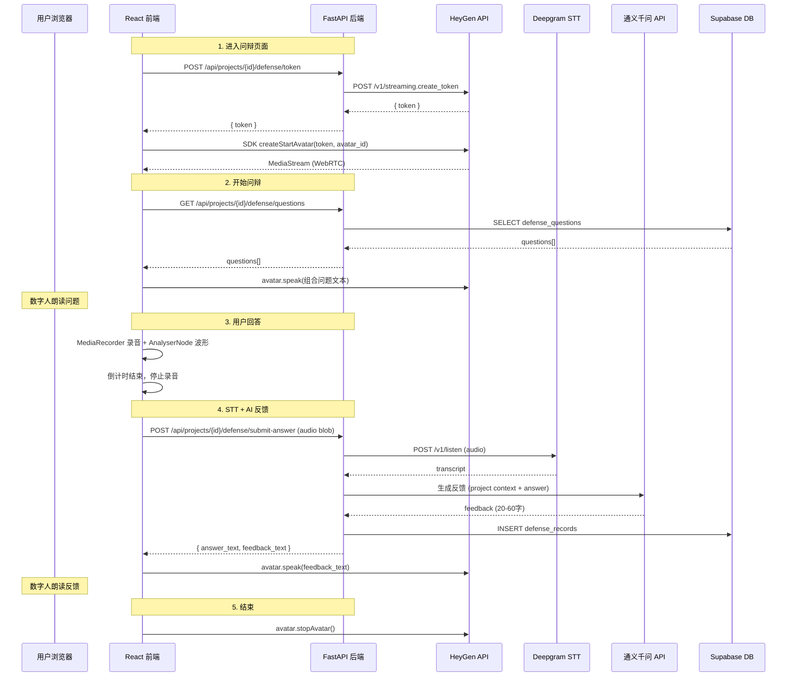

# Design Document: 数字人问辩 (Digital Human Defense)

## Overview

数字人问辩功能为 AI 评委系统新增一个与"文本评审"、"离线评审"、"现场路演"并列的功能模块。该功能集成 HeyGen Streaming Avatar SDK，在前端创建数字人评委形象，通过预定义问题向用户提问，录制用户回答并利用已有的 Deepgram STT 服务转写为文字，再由通义千问 AI 根据项目全部上下文生成简短反馈，最终由数字人评委口述反馈。

核心流程：
1. 项目简介提取时自动生成评委问题 → 用户可 CRUD 管理问题
2. 进入问辩页面 → 创建 HeyGen Avatar Session → 数字人朗读问题
3. 用户限时录音回答 → STT 转写 → AI 生成反馈 → 数字人朗读反馈
4. 全流程记录持久化，支持历史查看

### 设计决策

- **HeyGen SDK 在前端运行**：`@heygen/streaming-avatar` 是前端 SDK，通过 WebRTC 直接与 HeyGen 服务器通信。后端仅负责生成 access token，不参与视频流传输。
- **录音使用 Web Audio API**：浏览器端通过 MediaRecorder API 录音，同时使用 AnalyserNode 实现动态波形可视化。
- **复用已有服务**：STT 使用已有的 `stt_service.py`（Deepgram），AI 调用使用已有的 `ai_utils.py`（通义千问）。
- **问题自动生成与项目简介提取耦合**：在 `ProfileService.extract_profile` 完成后触发问题生成，避免额外的用户操作。

## Architecture



### 系统分层

| 层级 | 组件 | 职责 |
|------|------|------|
| 前端页面 | `DigitalDefense.tsx` | 问辩页面 UI、Avatar 生命周期管理、录音、波形可视化 |
| 前端组件 | `DefenseQuestionManager.tsx` | 预定义问题 CRUD（嵌入 ProjectDashboard） |
| 前端 API | `api.ts` (defenseApi) | 问辩相关 API 调用封装 |
| 后端路由 | `defense.py` | `/api/projects/{id}/defense/*` 路由 |
| 后端服务 | `heygen_service.py` | HeyGen token 生成 |
| 后端服务 | `defense_service.py` | 问题 CRUD、AI 问题生成、答案提交与反馈生成、记录管理 |
| 数据库 | `004_digital_human_defense.sql` | defense_questions + defense_records 表 |

## Components and Interfaces

### 后端 API 接口

#### 1. HeyGen Token 端点

```
POST /api/projects/{project_id}/defense/token
Response: { "token": "heygen_access_token" }
```

后端使用 `HEYGEN_API_KEY` 调用 HeyGen API 生成临时 access token，前端用此 token 初始化 SDK。

#### 2. 预定义问题 CRUD

```
GET    /api/projects/{project_id}/defense/questions          → DefenseQuestion[]
POST   /api/projects/{project_id}/defense/questions          → DefenseQuestion
PUT    /api/projects/{project_id}/defense/questions/{id}     → DefenseQuestion
DELETE /api/projects/{project_id}/defense/questions/{id}     → 204
```

#### 3. 答案提交与反馈生成

```
POST /api/projects/{project_id}/defense/submit-answer
Body: multipart/form-data { audio: File, answer_duration: int }
Response: DefenseRecord { id, questions_snapshot, user_answer_text, ai_feedback_text, status, created_at }
```

流程：接收音频 → Deepgram STT 转写 → 加载项目上下文 → 通义千问生成反馈 → 存储记录 → 返回结果。

#### 4. 问辩记录查询

```
GET /api/projects/{project_id}/defense/records → DefenseRecord[]
```

按 `created_at` 倒序返回。

### 后端服务

#### HeyGenService

```python
class HeyGenService:
    async def create_token(self) -> str:
        """调用 HeyGen API 生成 streaming access token"""
```

#### DefenseService

```python
class DefenseService:
    def __init__(self, supabase: Client):
        self._sb = supabase
        self._stt = STTService()

    # 问题管理
    async def list_questions(self, project_id: str) -> list[dict]
    async def create_question(self, project_id: str, content: str) -> dict
    async def update_question(self, question_id: str, content: str) -> dict
    async def delete_question(self, question_id: str) -> None

    # AI 问题自动生成
    async def generate_questions(self, project_id: str, profile: dict) -> list[dict]

    # 答案提交与反馈
    async def submit_answer(
        self, project_id: str, user_id: str,
        audio_content: bytes, answer_duration: int
    ) -> dict

    # 记录查询
    async def list_records(self, project_id: str) -> list[dict]
```

### 前端组件

#### DigitalDefense.tsx（问辩页面）

主要状态：
- `phase`: 'idle' | 'loading' | 'speaking' | 'recording' | 'processing' | 'feedback' | 'done'
- `avatarReady`: boolean
- `countdown`: number
- `answerDuration`: number (默认 30)
- `records`: DefenseRecord[]

生命周期：
1. 页面挂载 → 获取 token → 创建 Avatar Session → 加载历史记录
2. 用户点击"开始问辩" → 获取问题列表 → 组合文本 → avatar.speak()
3. speak 完成 → 开始录音 + 倒计时 → 倒计时结束 → 停止录音
4. 发送音频到后端 → 获取反馈 → avatar.speak(feedback)
5. 页面卸载 / beforeunload → avatar.stopAvatar()

#### DefenseQuestionManager.tsx（问题管理组件）

嵌入 ProjectDashboard，显示在项目简介下方。提供：
- 问题列表展示
- 新增/编辑/删除操作
- 40 字限制校验

### 前端 API 封装

```typescript
// api.ts 新增
export const defenseApi = {
  getToken: (projectId: string) =>
    api.post<{ token: string }>(`/projects/${projectId}/defense/token`).then(r => r.data),

  listQuestions: (projectId: string) =>
    api.get<DefenseQuestion[]>(`/projects/${projectId}/defense/questions`).then(r => r.data),

  createQuestion: (projectId: string, content: string) =>
    api.post<DefenseQuestion>(`/projects/${projectId}/defense/questions`, { content }).then(r => r.data),

  updateQuestion: (projectId: string, questionId: string, content: string) =>
    api.put<DefenseQuestion>(`/projects/${projectId}/defense/questions/${questionId}`, { content }).then(r => r.data),

  deleteQuestion: (projectId: string, questionId: string) =>
    api.delete(`/projects/${projectId}/defense/questions/${questionId}`),

  submitAnswer: (projectId: string, audio: Blob, answerDuration: number) => {
    const form = new FormData();
    form.append('audio', audio, 'answer.webm');
    form.append('answer_duration', String(answerDuration));
    return api.post<DefenseRecord>(`/projects/${projectId}/defense/submit-answer`, form, {
      headers: { 'Content-Type': 'multipart/form-data' },
      timeout: 120_000,
    }).then(r => r.data);
  },

  listRecords: (projectId: string) =>
    api.get<DefenseRecord[]>(`/projects/${projectId}/defense/records`).then(r => r.data),
};
```


## Data Models

### 数据库表

#### defense_questions 表

```sql
CREATE TABLE defense_questions (
    id UUID PRIMARY KEY DEFAULT gen_random_uuid(),
    project_id UUID NOT NULL REFERENCES projects(id) ON DELETE CASCADE,
    content TEXT NOT NULL CHECK (char_length(content) <= 40),
    sort_order INTEGER NOT NULL DEFAULT 0,
    created_at TIMESTAMPTZ NOT NULL DEFAULT now(),
    updated_at TIMESTAMPTZ NOT NULL DEFAULT now()
);

CREATE INDEX idx_defense_questions_project_id ON defense_questions(project_id);

-- RLS: 用户只能操作自己项目的问题
ALTER TABLE defense_questions ENABLE ROW LEVEL SECURITY;

CREATE POLICY "Users can manage their own project questions"
    ON defense_questions FOR ALL
    USING (project_id IN (SELECT id FROM projects WHERE user_id = auth.uid()))
    WITH CHECK (project_id IN (SELECT id FROM projects WHERE user_id = auth.uid()));
```

#### defense_records 表

```sql
CREATE TABLE defense_records (
    id UUID PRIMARY KEY DEFAULT gen_random_uuid(),
    project_id UUID NOT NULL REFERENCES projects(id) ON DELETE CASCADE,
    user_id UUID NOT NULL REFERENCES auth.users(id),
    questions_snapshot JSONB NOT NULL,  -- 问辩时的问题快照 [{"content": "...", "sort_order": 1}, ...]
    user_answer_text TEXT,
    ai_feedback_text TEXT,
    answer_duration INTEGER NOT NULL DEFAULT 30,
    status TEXT NOT NULL DEFAULT 'completed' CHECK (status IN ('completed', 'failed')),
    created_at TIMESTAMPTZ NOT NULL DEFAULT now()
);

CREATE INDEX idx_defense_records_project_id ON defense_records(project_id);

-- RLS: 用户只能查看和创建自己项目的记录
ALTER TABLE defense_records ENABLE ROW LEVEL SECURITY;

CREATE POLICY "Users can manage their own project records"
    ON defense_records FOR ALL
    USING (project_id IN (SELECT id FROM projects WHERE user_id = auth.uid()))
    WITH CHECK (project_id IN (SELECT id FROM projects WHERE user_id = auth.uid()));
```

### Pydantic 模型（schemas.py 新增）

```python
class DefenseQuestionCreate(BaseModel):
    content: str  # 最长 40 字

class DefenseQuestionResponse(BaseModel):
    id: str
    project_id: str
    content: str
    sort_order: int
    created_at: datetime
    updated_at: datetime

class DefenseRecordResponse(BaseModel):
    id: str
    project_id: str
    questions_snapshot: list[dict]
    user_answer_text: str | None
    ai_feedback_text: str | None
    answer_duration: int
    status: str
    created_at: datetime
```

### TypeScript 类型（types/index.ts 新增）

```typescript
export interface DefenseQuestion {
  id: string;
  project_id: string;
  content: string;
  sort_order: number;
  created_at: string;
  updated_at: string;
}

export interface DefenseRecord {
  id: string;
  project_id: string;
  questions_snapshot: Array<{ content: string; sort_order: number }>;
  user_answer_text: string | null;
  ai_feedback_text: string | null;
  answer_duration: number;
  status: 'completed' | 'failed';
  created_at: string;
}
```

### 配置扩展（config.py 新增）

```python
# HeyGen 配置
heygen_api_key: str = ""
heygen_avatar_id: str = "80d4afa941c243beb0a1116c95ea48ee"
```

### AI 反馈 Prompt

```
系统提示：你是一位专业的创业大赛评委。请根据以下项目信息和选手的回答，给出简短的评价反馈。
反馈要求：20-60个中文字符，语言简洁有力，直击要点。

项目简介：{project_profile}
BP 摘要：{bp_summary}
文本 PPT 摘要：{text_ppt_summary}
评委问题：{questions}
选手回答：{user_answer}

请直接输出反馈文本，不要包含其他内容。
```

### 问题自动生成 Prompt

```
系统提示：你是一位专业的创业大赛评委。请根据以下项目简介，生成3个评委提问。
要求：每个问题不超过40个中文字符，问题应针对项目的核心价值、商业模式、技术可行性等方面。

项目简介：
- 团队介绍：{team_intro}
- 所属领域：{domain}
- 创业状态：{startup_status}
- 已有成果：{achievements}
- 下一步目标：{next_goals}

请以 JSON 数组格式返回，如：["问题1", "问题2", "问题3"]
```


## Correctness Properties

*A property is a characteristic or behavior that should hold true across all valid executions of a system — essentially, a formal statement about what the system should do. Properties serve as the bridge between human-readable specifications and machine-verifiable correctness guarantees.*

### Property 1: AI 生成的问题长度约束

*For any* project profile（包含任意合法的团队介绍、领域、创业状态、已有成果、下一步目标），调用 `generate_questions` 后返回的每个问题的中文字符长度应 <= 40。

**Validates: Requirements 1.2, 1.4**

### Property 2: 问题创建 round-trip

*For any* 合法的问题内容（非空且长度 <= 40 的字符串），调用 `create_question` 后再调用 `list_questions`，返回的列表中应包含一个 content 与输入完全相同的问题。

**Validates: Requirements 2.2, 1.5**

### Property 3: 问题更新保持内容一致

*For any* 已存在的问题和任意合法的新内容（非空且 <= 40 字），调用 `update_question` 后再查询该问题，其 content 应等于新内容。

**Validates: Requirements 2.3**

### Property 4: 问题删除后不可查询

*For any* 已存在的问题，调用 `delete_question` 后再调用 `list_questions`，返回的列表中不应包含该问题的 id。

**Validates: Requirements 2.4**

### Property 5: 问题内容校验拒绝无效输入

*For any* 空字符串或纯空白字符串，以及任何长度超过 40 个字符的字符串，调用 `create_question` 或 `update_question` 应返回验证错误，且数据库中的问题列表不发生变化。

**Validates: Requirements 2.5, 2.6**

### Property 6: 问题组合文本格式正确

*For any* 非空的问题列表和任意项目名称，`format_questions_speech` 函数生成的文本应：(a) 包含项目名称，(b) 包含正确的问题数量，(c) 按顺序包含每个问题的内容，(d) 使用正确的中文序数词（"第一"、"第二"、"第三"等）。

**Validates: Requirements 5.5, 5.6**

### Property 7: 问辩记录持久化完整性

*For any* 成功完成的问辩流程（有效的音频输入和 AI 反馈），生成的 `defense_record` 应包含：非空的 `questions_snapshot`（与提交时的问题列表一致）、非空的 `user_answer_text`、非空的 `ai_feedback_text`、与用户设置一致的 `answer_duration`、状态为 `completed`。

**Validates: Requirements 6.8, 7.4, 8.1, 9.3**

### Property 8: 历史记录按时间倒序排列

*For any* 项目的多条问辩记录，调用 `list_records` 返回的列表中，每条记录的 `created_at` 应大于等于其后一条记录的 `created_at`。

**Validates: Requirements 8.2**

### Property 9: 新问辩不修改已有记录

*For any* 已有 N 条问辩记录的项目，执行一次新的问辩后，原有 N 条记录的所有字段应保持不变，且总记录数变为 N+1。

**Validates: Requirements 3.7**

### Property 10: 回答时长范围钳制

*For any* 整数值 d，经过 `clamp_duration` 处理后的结果应满足：10 <= result <= 120。当 d < 10 时 result = 10，当 d > 120 时 result = 120，当 10 <= d <= 120 时 result = d。

**Validates: Requirements 9.2, 9.4**

### Property 11: AI 反馈长度约束

*For any* 有效的项目上下文和用户回答文本，`generate_feedback` 返回的反馈文本的中文字符长度应在 20 至 60 之间（含边界）。

**Validates: Requirements 7.2, 7.3**

## Error Handling

| 场景 | 处理方式 | HTTP 状态码 |
|------|----------|-------------|
| HEYGEN_API_KEY 未配置 | 记录警告日志，返回 "数字人服务未配置" | 503 |
| HeyGen token 生成失败 | 返回 "数字人服务暂时不可用，请稍后重试" | 502 |
| Avatar Session 创建失败 | 前端显示错误提示，提供重试按钮 | — (前端处理) |
| Avatar Session 中途断开 | 前端提示连接断开，提供重新连接选项 | — (前端处理) |
| 麦克风权限未授权 | 前端提示 "请允许麦克风权限以进行回答录音" | — (前端处理) |
| STT 转写失败 | 返回错误，前端允许用户手动输入回答文本 | 502 |
| AI 反馈生成失败 | 记录 defense_record 状态为 'failed'，返回错误提示 | 502 |
| 问题内容为空 | 返回验证错误 "问题内容不能为空" | 422 |
| 问题内容超过 40 字 | 返回验证错误 "问题不能超过40个字" | 422 |
| 回答时长超出范围 | 自动钳制到 [10, 120] 范围，不报错 | — |
| 项目无预定义问题时尝试开始问辩 | 前端禁用按钮；后端返回 400 | 400 |

### 前端错误处理策略

- Avatar 相关错误通过 `StreamingEvents.STREAM_DISCONNECTED` 事件监听
- 网络错误通过已有的 axios 拦截器统一处理
- 麦克风权限通过 `navigator.mediaDevices.getUserMedia` 的 catch 处理
- 页面离开清理通过 `useEffect` cleanup + `beforeunload` 事件双重保障

## Testing Strategy

### 属性测试（Property-Based Testing）

使用 **Hypothesis**（Python）作为属性测试库，每个属性测试至少运行 100 次迭代。

每个测试用 comment 标注对应的设计属性：
```python
# Feature: digital-human-defense, Property 1: AI 生成的问题长度约束
```

属性测试覆盖的 Properties：
- Property 1: 生成随机 profile 数据，验证生成的问题长度
- Property 2: 生成随机合法问题内容，验证创建后可查询
- Property 3: 生成随机合法新内容，验证更新后内容一致
- Property 4: 创建随机问题后删除，验证不可查询
- Property 5: 生成随机无效输入（空/超长），验证拒绝
- Property 6: 生成随机问题列表和项目名，验证格式
- Property 7: 模拟完整问辩流程，验证记录字段完整
- Property 8: 创建多条记录，验证排序
- Property 9: 创建记录后新增，验证旧记录不变
- Property 10: 生成随机整数，验证钳制行为
- Property 11: 生成随机上下文，验证反馈长度

### 单元测试

单元测试聚焦于具体示例和边界情况：

- **HeyGenService**: mock HTTP 调用，验证 token 生成成功/失败场景
- **DefenseService.generate_questions**: mock AI API，验证生成 3 个问题的具体示例
- **DefenseService.submit_answer**: mock STT + AI，验证完整流程的具体示例
- **问题 CRUD**: 验证具体的创建/更新/删除操作
- **错误场景**: HEYGEN_API_KEY 未配置、STT 失败、AI 失败等
- **前端组件**: 使用 React Testing Library 测试 DigitalDefense 页面的状态转换

### 测试配置

```python
# conftest.py
from hypothesis import settings as hypothesis_settings

hypothesis_settings.register_profile("ci", max_examples=100)
hypothesis_settings.load_profile("ci")
```

前端测试使用 Vitest + React Testing Library，mock `@heygen/streaming-avatar` SDK。

