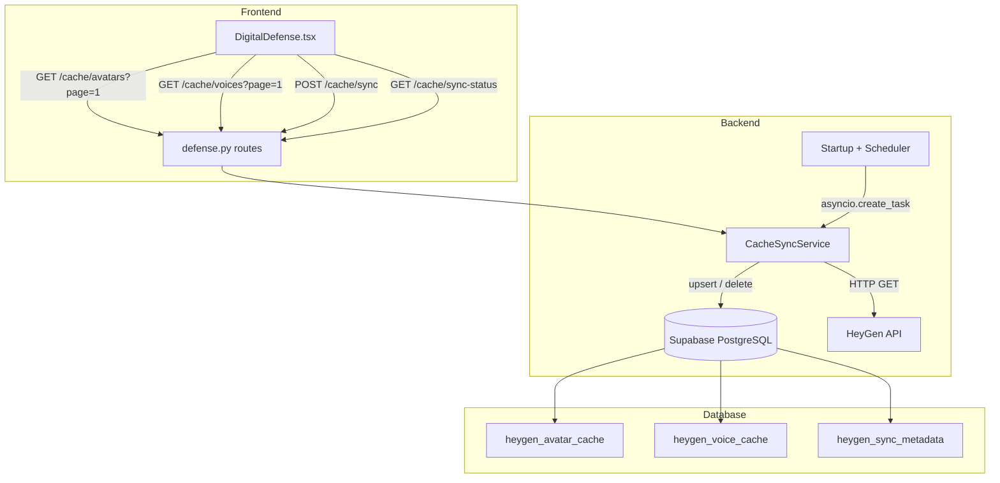
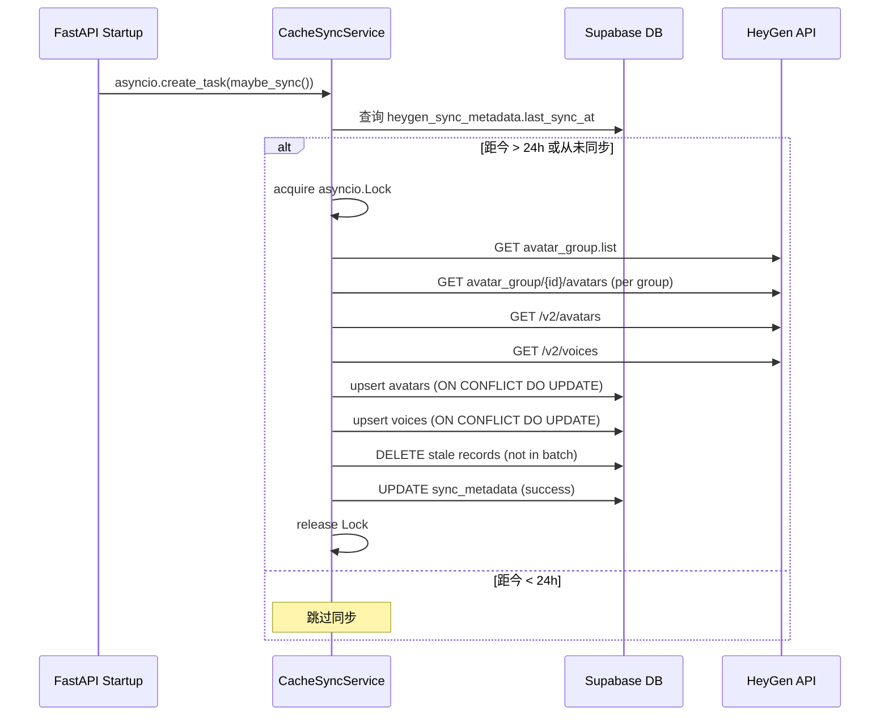

# 设计文档：HeyGen Avatar 与 Voice 缓存机制

## 概述

本功能将 HeyGen avatar 和 voice 数据从实时 API 调用模式迁移到本地数据库缓存模式。核心变更包括：

1. 新增三张数据库表（`heygen_avatar_cache`、`heygen_voice_cache`、`heygen_sync_metadata`）
2. 新增 `CacheSyncService`，负责从 HeyGen API 拉取数据并 upsert 到本地数据库
3. 利用 FastAPI lifespan + asyncio 实现启动时条件同步和 24 小时周期同步
4. 新增缓存查询 API（分页、搜索、过滤），替代原有的实时 HeyGen API 代理
5. 前端 avatar/voice 选择器改为调用缓存 API，支持分页加载

关键设计决策：
- 使用 `asyncio.create_task()` + `asyncio.Lock` 实现非阻塞同步和并发锁，不引入 APScheduler 等外部依赖
- Upsert 策略基于 `ON CONFLICT (heygen_avatar_id) DO UPDATE`，同步完成后删除不在最新批次中的记录
- 缓存 API 路径挂载在 `/api/projects/{project_id}/defense/avatar/cache/` 下，与现有路由结构一致

## 架构



### 同步流程



## 组件与接口

### 1. CacheSyncService（新增）

位置：`backend/app/services/avatar/cache_sync_service.py`

```python
class CacheSyncService:
    """HeyGen avatar/voice 缓存同步服务。"""

    def __init__(self, supabase: Client):
        self._sb = supabase
        self._lock = asyncio.Lock()

    async def maybe_sync(self) -> bool:
        """检查是否需要同步（>24h 或从未同步），需要则执行。返回是否执行了同步。"""

    async def force_sync(self) -> None:
        """强制执行全量同步（手动触发）。如果锁被占用则抛出异常。"""

    async def _do_full_sync(self) -> None:
        """执行全量同步：拉取 HeyGen 数据 → upsert → 清理过期 → 更新元数据。"""

    async def _sync_avatars(self) -> tuple[list[dict], set[str]]:
        """从 HeyGen API 拉取所有 avatar，返回 (avatar_list, seen_ids)。"""

    async def _sync_voices(self) -> tuple[list[dict], set[str]]:
        """从 HeyGen API 拉取所有 voice，返回 (voice_list, seen_ids)。"""

    async def _upsert_avatars(self, avatars: list[dict]) -> None:
        """批量 upsert avatar 到 heygen_avatar_cache。"""

    async def _upsert_voices(self, voices: list[dict]) -> None:
        """批量 upsert voice 到 heygen_voice_cache。"""

    async def _cleanup_stale(self, table: str, id_column: str, valid_ids: set[str]) -> None:
        """删除不在 valid_ids 中的记录。"""

    async def _update_metadata(self, resource_type: str, status: str, count: int, error: str | None = None) -> None:
        """更新 heygen_sync_metadata。"""

    async def get_sync_status(self) -> dict:
        """查询最近一次同步状态。"""

    def is_syncing(self) -> bool:
        """返回当前是否正在同步。"""
```

### 2. 缓存查询 API（新增路由）

挂载在现有 `defense.py` 路由文件中，路径前缀 `/api/projects/{project_id}/defense/avatar/cache/`。

| 方法 | 路径 | 说明 |
|------|------|------|
| GET | `/cache/avatars` | 分页查询 avatar 缓存，支持 search、is_custom 过滤 |
| GET | `/cache/voices` | 分页查询 voice 缓存，支持 search 过滤 |
| POST | `/cache/sync` | 手动触发同步，返回 202 |
| GET | `/cache/sync-status` | 查询同步状态 |

#### 响应格式

```python
class PaginatedAvatarResponse(BaseModel):
    items: list[AvatarCacheItem]
    total: int
    page: int
    page_size: int
    total_pages: int

class AvatarCacheItem(BaseModel):
    id: str                    # heygen_avatar_id，兼容前端 AvatarInfo.id
    name: str
    preview_image_url: str
    avatar_type: str           # "photo_avatar" | "digital_twin"
    is_custom: bool
    group_id: str | None = None

class VoiceCacheItem(BaseModel):
    voice_id: str              # heygen_voice_id
    name: str
    language: str
    gender: str
    preview_audio: str
    is_custom: bool
```

### 3. 定时调度器（新增）

位置：集成在 `backend/app/main.py` 的 lifespan 事件中。

```python
async def _periodic_cache_sync():
    """每 24 小时执行一次缓存同步的后台循环。"""
    sb = get_supabase()
    svc = CacheSyncService(sb)
    while True:
        await asyncio.sleep(86400)  # 24h
        try:
            await svc.force_sync()
        except Exception:
            logger.exception("定时缓存同步失败")
```

在 `startup` 事件中：
```python
asyncio.create_task(svc.maybe_sync())      # 启动时条件同步
asyncio.create_task(_periodic_cache_sync()) # 24h 周期同步
```

### 4. 前端适配

- `defenseApi` 新增 `listCachedAvatars(projectId, params)` 和 `listCachedVoices(projectId, params)` 方法
- `DigitalDefense.tsx` 中 avatar Select 改为调用缓存 API，使用 `onPopupScroll` 实现滚动加载更多
- 新增"刷新"按钮调用 `POST /cache/sync`，同步完成后刷新列表
- voice Select 同样改为缓存 API

## 数据模型

### 数据库迁移（008_heygen_avatar_cache.sql）

```sql
-- heygen_avatar_cache: 缓存 HeyGen avatar 数据
CREATE TABLE IF NOT EXISTS heygen_avatar_cache (
    id UUID PRIMARY KEY DEFAULT gen_random_uuid(),
    heygen_avatar_id TEXT NOT NULL,
    name TEXT NOT NULL DEFAULT '',
    preview_image_url TEXT NOT NULL DEFAULT '',
    avatar_type TEXT NOT NULL DEFAULT 'photo_avatar'
        CHECK (avatar_type IN ('photo_avatar', 'digital_twin')),
    is_custom BOOLEAN NOT NULL DEFAULT FALSE,
    group_id TEXT,
    status TEXT DEFAULT 'active',
    default_voice_id TEXT,
    synced_at TIMESTAMPTZ NOT NULL DEFAULT NOW(),
    created_at TIMESTAMPTZ NOT NULL DEFAULT NOW(),
    updated_at TIMESTAMPTZ NOT NULL DEFAULT NOW(),
    CONSTRAINT uq_heygen_avatar_id UNIQUE (heygen_avatar_id)
);

CREATE INDEX IF NOT EXISTS idx_hac_name ON heygen_avatar_cache (name);
CREATE INDEX IF NOT EXISTS idx_hac_is_custom ON heygen_avatar_cache (is_custom);

-- heygen_voice_cache: 缓存 HeyGen voice 数据
CREATE TABLE IF NOT EXISTS heygen_voice_cache (
    id UUID PRIMARY KEY DEFAULT gen_random_uuid(),
    heygen_voice_id TEXT NOT NULL,
    name TEXT NOT NULL DEFAULT '',
    language TEXT NOT NULL DEFAULT '',
    gender TEXT NOT NULL DEFAULT '',
    preview_audio TEXT NOT NULL DEFAULT '',
    is_custom BOOLEAN NOT NULL DEFAULT FALSE,
    synced_at TIMESTAMPTZ NOT NULL DEFAULT NOW(),
    created_at TIMESTAMPTZ NOT NULL DEFAULT NOW(),
    updated_at TIMESTAMPTZ NOT NULL DEFAULT NOW(),
    CONSTRAINT uq_heygen_voice_id UNIQUE (heygen_voice_id)
);

CREATE INDEX IF NOT EXISTS idx_hvc_name ON heygen_voice_cache (name);

-- heygen_sync_metadata: 同步元数据
CREATE TABLE IF NOT EXISTS heygen_sync_metadata (
    id UUID PRIMARY KEY DEFAULT gen_random_uuid(),
    resource_type TEXT NOT NULL UNIQUE CHECK (resource_type IN ('avatar', 'voice')),
    last_sync_at TIMESTAMPTZ,
    last_sync_status TEXT DEFAULT 'never'
        CHECK (last_sync_status IN ('never', 'success', 'failed')),
    last_sync_error TEXT,
    avatar_count INT DEFAULT 0,
    voice_count INT DEFAULT 0
);

-- 预插入元数据行
INSERT INTO heygen_sync_metadata (resource_type, last_sync_status)
VALUES ('avatar', 'never'), ('voice', 'never')
ON CONFLICT (resource_type) DO NOTHING;

-- RLS 策略：缓存表对已认证用户只读
ALTER TABLE heygen_avatar_cache ENABLE ROW LEVEL SECURITY;
ALTER TABLE heygen_voice_cache ENABLE ROW LEVEL SECURITY;
ALTER TABLE heygen_sync_metadata ENABLE ROW LEVEL SECURITY;

CREATE POLICY "authenticated_read_avatar_cache" ON heygen_avatar_cache
    FOR SELECT TO authenticated USING (true);

CREATE POLICY "authenticated_read_voice_cache" ON heygen_voice_cache
    FOR SELECT TO authenticated USING (true);

CREATE POLICY "authenticated_read_sync_metadata" ON heygen_sync_metadata
    FOR SELECT TO authenticated USING (true);

-- service_role 可以写入（后端使用 service_role key）
CREATE POLICY "service_write_avatar_cache" ON heygen_avatar_cache
    FOR ALL TO service_role USING (true) WITH CHECK (true);

CREATE POLICY "service_write_voice_cache" ON heygen_voice_cache
    FOR ALL TO service_role USING (true) WITH CHECK (true);

CREATE POLICY "service_write_sync_metadata" ON heygen_sync_metadata
    FOR ALL TO service_role USING (true) WITH CHECK (true);
```

### Pydantic 模型（新增到 schemas.py）

```python
class AvatarCacheItem(BaseModel):
    id: str                    # heygen_avatar_id
    name: str
    preview_image_url: str
    avatar_type: str
    is_custom: bool
    group_id: str | None = None

class VoiceCacheItem(BaseModel):
    voice_id: str              # heygen_voice_id
    name: str
    language: str
    gender: str
    preview_audio: str
    is_custom: bool

class PaginatedResponse(BaseModel):
    items: list
    total: int
    page: int
    page_size: int
    total_pages: int

class SyncStatusResponse(BaseModel):
    avatar_last_sync_at: datetime | None
    avatar_last_sync_status: str
    avatar_count: int
    voice_last_sync_at: datetime | None
    voice_last_sync_status: str
    voice_count: int
```


## 正确性属性（Correctness Properties）

*属性（Property）是指在系统所有合法执行中都应成立的特征或行为——本质上是对系统应做什么的形式化陈述。属性是人类可读规格说明与机器可验证正确性保证之间的桥梁。*

### Property 1: Upsert 幂等性

*For any* avatar 或 voice 数据，对同一个 `heygen_avatar_id`（或 `heygen_voice_id`）执行两次 upsert，数据库中应只存在一条记录，且字段值等于最后一次 upsert 的输入值。

**Validates: Requirements 1.5, 1.6, 2.4**

### Property 2: 同步决策正确性

*For any* `last_sync_at` 时间戳（或 NULL），`maybe_sync()` 应当在且仅在 `last_sync_at` 为 NULL 或距当前时间超过 24 小时时执行同步。

**Validates: Requirements 2.1**

### Property 3: 同步完整性

*For any* HeyGen API 返回的 avatar 列表和 voice 列表，同步完成后，缓存表中应包含 API 返回的每一条记录（通过 heygen_avatar_id / heygen_voice_id 匹配）。

**Validates: Requirements 2.2, 2.3**

### Property 4: 过期数据清理

*For any* 缓存表中的已有记录集合和新的同步批次，同步完成后，缓存表中应恰好只包含新批次中的记录——不在新批次中的旧记录应被删除。

**Validates: Requirements 2.5**

### Property 5: 同步元数据一致性

*For any* 成功的同步操作，同步 N 个 avatar 和 M 个 voice 后，`heygen_sync_metadata` 表中 `last_sync_status` 应为 `success`，`avatar_count` 应等于 N，`voice_count` 应等于 M，且 `last_sync_at` 应不早于同步开始时间。

**Validates: Requirements 2.6**

### Property 6: 失败时缓存不变性

*For any* 已有缓存状态，当 HeyGen API 调用失败时，缓存表中的数据应与失败前完全一致（不增不减不改），且 `last_sync_status` 应为 `failed`。

**Validates: Requirements 2.7**

### Property 7: 并发同步互斥

*For any* 正在执行同步的状态，再次请求同步应被拒绝（返回 409），且不应启动第二个同步任务。

**Validates: Requirements 4.3**

### Property 8: 分页正确性

*For any* 缓存中的 N 条记录和任意合法的 `page`、`page_size` 参数，返回的 `items` 数量应等于 `min(page_size, N - (page-1)*page_size)`（最后一页可能不满），`total` 应等于 N，`total_pages` 应等于 `ceil(N / page_size)`。

**Validates: Requirements 5.1, 5.2, 5.3, 5.4**

### Property 9: 搜索过滤正确性

*For any* 搜索关键词 `q` 和缓存中的 avatar 集合，返回的每一条记录的 `name` 字段应包含 `q`（不区分大小写），且所有 `name` 包含 `q` 的记录都应被返回。

**Validates: Requirements 5.5**

### Property 10: is_custom 过滤正确性

*For any* `is_custom` 过滤值（true 或 false），返回的每一条 avatar 记录的 `is_custom` 字段应等于过滤值。

**Validates: Requirements 5.6**

## 错误处理

| 场景 | 处理方式 |
|------|----------|
| HeyGen API 超时或 HTTP 错误 | 记录 ERROR 日志，更新 sync_metadata 为 failed，保留现有缓存不变 |
| HeyGen API 返回空数据 | 正常处理（清空缓存），记录 WARNING 日志 |
| 数据库 upsert 失败 | 回滚当前同步，记录 ERROR 日志，更新 sync_metadata 为 failed |
| 并发同步请求 | 返回 409 Conflict，提示"同步正在进行中" |
| 缓存为空时查询 | 正常返回空列表 + total=0 |
| 分页参数越界（page > total_pages） | 返回空 items + 正确的 total/total_pages 元数据 |
| 手动同步时 HeyGen API Key 未配置 | 返回 503，提示"HeyGen API Key 未配置" |

## 测试策略

### 属性测试（Property-Based Testing）

使用 **Hypothesis** 库（项目已有 `.hypothesis` 目录，说明已在使用）。

每个正确性属性对应一个属性测试，最少运行 100 次迭代。测试标签格式：

```
Feature: heygen-avatar-cache, Property {N}: {property_text}
```

属性测试重点：
- **Property 1 (Upsert 幂等性)**：生成随机 avatar/voice 数据，执行两次 upsert，验证记录唯一且值正确
- **Property 2 (同步决策)**：生成随机时间戳，验证 `should_sync()` 决策逻辑
- **Property 4 (过期清理)**：生成随机旧缓存集合和新批次集合，验证清理后缓存 = 新批次
- **Property 8 (分页)**：生成随机记录数和分页参数，验证分页元数据和 items 数量
- **Property 9 (搜索)**：生成随机名称和搜索词，验证过滤结果
- **Property 10 (is_custom 过滤)**：生成随机 is_custom 值的记录，验证过滤结果

### 单元测试

单元测试覆盖具体示例和边界情况：
- 缓存表为空时查询返回空列表
- 手动同步返回 202 + 正确的响应体
- 同步状态查询返回正确的元数据格式
- HeyGen API 返回格式异常时的错误处理
- `_map_avatar_type` 映射逻辑（video_avatar → digital_twin）

### 测试配置

- 属性测试框架：Hypothesis（Python）
- 每个属性测试最少 100 次迭代：`@settings(max_examples=100)`
- 测试文件位置：`backend/tests/test_heygen_avatar_cache.py`
- 同步服务测试使用 mock 替代实际 HeyGen API 和 Supabase 客户端
