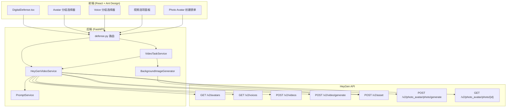
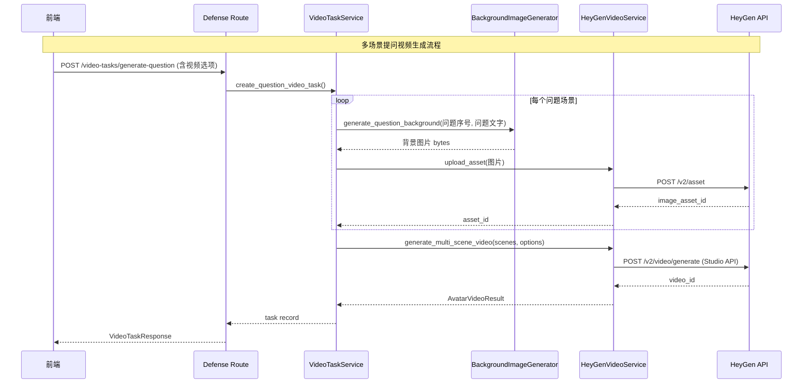

# 设计文档：HeyGen 模式优化

## 概述

本设计对数字人问辩系统的 HeyGen 模式进行全面升级，涵盖以下核心变更：

1. **Avatar 类型识别**：基于 API 返回的 `avatar_type` 字段区分 Photo Avatar 与 Digital Twin，替代当前基于 ID 格式的判断逻辑
2. **分类展示**：前端数字人和音色选择器改为分组下拉（"我的" / "公共"），并为用户自有 Avatar 显示类型标签
3. **差异化视频生成**：Photo Avatar 使用新版 `POST /v2/videos` API 并附加 `motion_prompt` + `expressiveness`；Digital Twin 省略这些参数
4. **丰富视频选项**：新增语种、分辨率、宽高比、表情丰富度、背景移除等控件，所有视频强制开启字幕
5. **多场景视频**：利用 Studio API 的 `video_inputs` 数组，每个问题生成独立场景，使用 Pillow 动态生成问题文字背景图，通过 Asset API 上传后作为场景背景
6. **Photo Avatar 创建**：在前端提供创建入口，调用 `POST /v2/photo_avatar/photo/generate`
7. **Schema 更新**：新增视频生成选项模型和 Photo Avatar 创建模型
8. **视频复用机制**：扩展 config_hash 计算逻辑，纳入所有视频选项参数，确保配置不变时复用已有视频；前端区分显示复用/新生成状态
9. **数据库迁移**：扩展 `defense_video_tasks` 表，新增 `config_hash`、`avatar_type`、`video_options` 列

### 设计决策与理由

| 决策 | 理由 |
|------|------|
| 多场景视频使用 Studio API (`v2/video/generate`) 而非新版 `v2/videos` | 新版 API 不支持多场景 `video_inputs` 数组，Studio API 支持 1-50 个场景 |
| 单场景反馈视频使用新版 `v2/videos` API | 反馈视频只有一个场景，新版 API 更简洁且支持 Photo Avatar 专属参数 |
| 问题背景图使用 Pillow 在后端生成 | 避免前端复杂的 Canvas 操作，后端可统一控制视觉风格，且生成的图片可直接通过 Asset API 上传 |
| 字幕强制开启，不提供关闭选项 | 问辩场景下字幕对理解至关重要，减少用户决策负担 |
| Motion Prompt 从模板文件加载 | 与现有 `prompt_service` 架构一致，便于后续调整而无需改代码 |
| config_hash 纳入所有视频选项 | 确保任何参数变化都会触发重新生成，避免复用不匹配的视频 |
| video_options 使用 JSONB 存储 | 避免为每个选项单独加列，灵活应对未来新增参数 |
| 前端区分复用/新生成状态 | 让用户明确知道视频来源，避免困惑（如"为什么这么快就好了"） |

## 架构

### 系统架构图



### 数据流



## 组件与接口

### 1. HeyGenVideoService（后端核心服务）

文件：`backend/app/services/avatar/heygen_video_service.py`

**新增/修改方法：**

```python
class HeyGenVideoService(VideoAvatarProvider):
    """HeyGen 视频生成服务，支持新版 API 和多场景 Studio API。"""

    async def list_avatars(self) -> list[dict]:
        """列出 Avatar，包含 avatar_type 和 is_custom 字段。
        
        返回格式：
        {
            "id": str,
            "name": str,
            "preview_image_url": str,
            "avatar_type": "photo_avatar" | "digital_twin",
            "is_custom": bool
        }
        """

    async def generate_video(
        self,
        text: str,
        avatar_id: str | None = None,
        voice_id: str | None = None,
        avatar_type: str | None = None,
        resolution: str = "720p",
        aspect_ratio: str = "16:9",
        expressiveness: str = "medium",
        remove_background: bool = False,
        voice_locale: str = "zh-CN",
    ) -> AvatarVideoResult:
        """使用新版 POST /v2/videos API 生成单场景视频。
        
        - Photo Avatar: 附加 motion_prompt + expressiveness
        - Digital Twin: 省略 motion_prompt + expressiveness
        - 始终开启 caption: true
        """

    async def generate_multi_scene_video(
        self,
        scenes: list[dict],
        avatar_id: str,
        voice_id: str,
        avatar_type: str,
        resolution: str = "720p",
        aspect_ratio: str = "16:9",
        expressiveness: str = "medium",
        voice_locale: str = "zh-CN",
    ) -> AvatarVideoResult:
        """使用 Studio API (POST /v2/video/generate) 生成多场景视频。
        
        scenes 格式：
        [
            {"text": str, "background_asset_id": str | None, "scale": float, "position": dict},
            ...
        ]
        """

    async def upload_asset(self, image_bytes: bytes, filename: str = "bg.png") -> str:
        """通过 POST /v2/asset 上传图片资源，返回 asset_id。"""

    async def create_photo_avatar(self, params: dict) -> dict:
        """调用 POST /v2/photo_avatar/photo/generate 创建 Photo Avatar。
        返回 {"generation_id": str}
        """

    async def check_photo_avatar_status(self, generation_id: str) -> dict:
        """调用 GET /v2/photo_avatar/photo/{generation_id} 查询创建状态。
        返回 {"generation_id": str, "status": str}
        """
```

### 2. BackgroundImageGenerator（新增模块）

文件：`backend/app/services/avatar/background_generator.py`

```python
class BackgroundImageGenerator:
    """使用 Pillow 生成问题文字背景图片。"""

    def generate(
        self,
        question_number: int,
        question_text: str,
        width: int = 1920,
        height: int = 1080,
    ) -> bytes:
        """生成包含问题序号和文字的背景图片。
        
        布局：
        - 左侧 40% 留给数字人
        - 右侧 60% 显示问题文字
        - 顶部显示 "问题 N"
        - 中部显示问题内容（自动换行）
        - 统一配色：深蓝渐变背景 + 白色文字
        
        Returns:
            PNG 格式图片的 bytes
        """
```

### 3. VideoTaskService（修改）

文件：`backend/app/services/video_task_service.py`

**修改 `create_question_video_task`**：
- 接收新增的视频选项参数
- 将问题拆分为多个场景
- 第一个场景为开场白（纯色背景）
- 后续场景各对应一个问题（带问题文字背景图）
- 调用 `generate_multi_scene_video` 而非 `generate_video`
- config_hash 计算纳入新增选项参数

### 4. Defense Route（修改）

文件：`backend/app/routes/defense.py`

**新增端点：**

```python
@router.post("/avatar/heygen/photo-avatar")
async def create_photo_avatar(body: PhotoAvatarCreateRequest) -> dict:
    """创建 Photo Avatar。"""

@router.get("/avatar/heygen/photo-avatar/{generation_id}")
async def check_photo_avatar_status(generation_id: str) -> dict:
    """查询 Photo Avatar 创建状态。"""
```

**修改端点：**

```python
# GenerateQuestionVideoRequest 扩展为包含视频选项
class GenerateQuestionVideoRequest(BaseModel):
    avatar_id: str | None = None
    voice_id: str | None = None
    avatar_type: str | None = None
    resolution: str = "720p"
    aspect_ratio: str = "16:9"
    expressiveness: str = "medium"
    remove_background: bool = False
    voice_locale: str = "zh-CN"
```

### 5. 前端组件变更

**DigitalDefense.tsx 修改：**
- Avatar 选择器改为 `<Select>` 分组模式（`<Select.OptGroup>`），分为"我的"和"公共"
- "我的"分组中每个条目显示类型标签（Photo Avatar / Digital Twin）
- Voice 选择器同样改为分组模式
- 新增视频选项面板：语种、分辨率、宽高比、表情丰富度（仅 Photo Avatar）、背景移除
- 新增"创建 Photo Avatar"按钮和创建表单 Modal
- `generateQuestionVideo` API 调用传递新增选项参数

## 数据模型

### 后端 Pydantic 模型（schemas.py 新增）

```python
class VideoGenerationOptions(BaseModel):
    """视频生成选项"""
    avatar_id: str | None = None
    voice_id: str | None = None
    avatar_type: str | None = None  # "photo_avatar" | "digital_twin"
    resolution: str = "720p"        # "1080p" | "720p"
    aspect_ratio: str = "16:9"      # "16:9" | "9:16"
    expressiveness: str = "medium"  # "low" | "medium" | "high" (仅 Photo Avatar)
    remove_background: bool = False
    voice_locale: str = "zh-CN"


class PhotoAvatarCreateRequest(BaseModel):
    """Photo Avatar 创建请求"""
    name: str
    age: str          # "Young Adult" | "Early Middle Age" | "Late Middle Age" | "Senior" | "Unspecified"
    gender: str       # "Woman" | "Man" | "Unspecified"
    ethnicity: str
    orientation: str  # "square" | "horizontal" | "vertical"
    pose: str         # "half_body" | "close_up" | "full_body"
    style: str        # "Realistic" | "Pixar" | "Cinematic" | "Vintage" | "Noir" | "Cyberpunk" | "Unspecified"
    appearance: str = Field(..., max_length=1000)


class PhotoAvatarStatusResponse(BaseModel):
    """Photo Avatar 创建状态响应"""
    generation_id: str
    status: str       # "pending" | "processing" | "completed" | "failed"


class VideoTaskResponse(BaseModel):
    """视频任务响应（扩展已有模型）"""
    # ... 已有字段 ...
    is_reused: bool = False  # 是否为复用的已有视频
```

### HeyGen API 请求 Payload

**新版 API (`POST /v2/videos`) — 单场景/反馈视频：**

```json
{
    "caption": true,
    "title": "defense-feedback",
    "resolution": "720p",
    "aspect_ratio": "16:9",
    "remove_background": false,
    "avatar_id": "8d4aa85254354488a0f9bce7b4c3549e",
    "script": {
        "type": "text",
        "input": "反馈文本内容",
        "voice_id": "769716d5135541db93e95ce84508c59e",
        "voice_settings": {
            "locale": "zh-CN"
        }
    },
    "motion_prompt": "...(仅 Photo Avatar)",
    "expressiveness": "medium (仅 Photo Avatar)"
}
```

**Studio API (`POST /v2/video/generate`) — 多场景提问视频：**

```json
{
    "video_inputs": [
        {
            "character": {
                "type": "avatar",
                "avatar_id": "8d4aa85254354488a0f9bce7b4c3549e",
                "scale": 1.0
            },
            "voice": {
                "type": "text",
                "input_text": "开场白文本",
                "voice_id": "769716d5135541db93e95ce84508c59e"
            },
            "background": {
                "type": "color",
                "value": "#1a1a2e"
            }
        },
        {
            "character": {
                "type": "avatar",
                "avatar_id": "8d4aa85254354488a0f9bce7b4c3549e",
                "scale": 0.6,
                "offset": {"x": -0.3, "y": 0.0}
            },
            "voice": {
                "type": "text",
                "input_text": "第一个问题的语音文本",
                "voice_id": "769716d5135541db93e95ce84508c59e"
            },
            "background": {
                "type": "image",
                "image_asset_id": "uploaded_asset_id_1"
            }
        }
    ],
    "dimension": {"width": 1280, "height": 720},
    "caption": true
}
```

### 前端 TypeScript 类型（types/index.ts 新增）

```typescript
interface AvatarInfo {
    id: string;
    name: string;
    preview_image_url: string;
    avatar_type: 'photo_avatar' | 'digital_twin';
    is_custom: boolean;
}

interface VideoGenerationOptions {
    avatar_id?: string;
    voice_id?: string;
    avatar_type?: 'photo_avatar' | 'digital_twin';
    resolution?: '1080p' | '720p';
    aspect_ratio?: '16:9' | '9:16';
    expressiveness?: 'low' | 'medium' | 'high';
    remove_background?: boolean;
    voice_locale?: string;
}

interface PhotoAvatarCreateParams {
    name: string;
    age: string;
    gender: string;
    ethnicity: string;
    orientation: string;
    pose: string;
    style: string;
    appearance: string;
}

// VideoTask 类型扩展（已有类型新增字段）
interface VideoTask {
    // ... 已有字段 ...
    is_reused?: boolean;  // 是否为复用的已有视频
}
```


## 数据库变更

### 迁移脚本：`007_heygen_mode_optimization.sql`

```sql
-- HeyGen 模式优化 - 数据库迁移脚本
-- 变更: 扩展 defense_video_tasks 表，支持视频复用和选项存储

-- ============================================================
-- 1. defense_video_tasks 表扩展
-- ============================================================

-- config_hash: 用于视频复用匹配（问题+avatar+voice+所有视频选项的 MD5）
ALTER TABLE defense_video_tasks
    ADD COLUMN IF NOT EXISTS config_hash TEXT;

-- avatar_type: 记录生成时使用的数字人类型
ALTER TABLE defense_video_tasks
    ADD COLUMN IF NOT EXISTS avatar_type TEXT
    CHECK (avatar_type IN ('photo_avatar', 'digital_twin'));

-- video_options: 存储完整的视频生成选项快照（JSONB）
ALTER TABLE defense_video_tasks
    ADD COLUMN IF NOT EXISTS video_options JSONB DEFAULT '{}';

-- 条件索引：加速 config_hash 复用查询（仅索引已完成的任务）
CREATE INDEX IF NOT EXISTS idx_dvt_config_hash
    ON defense_video_tasks(config_hash)
    WHERE status = 'completed';
```

### 表结构变更说明

| 列名 | 类型 | 说明 |
|------|------|------|
| `config_hash` | `TEXT` | MD5 哈希值，由 `sorted_questions + avatar_id + voice_id + avatar_type + resolution + aspect_ratio + expressiveness + remove_background + voice_locale` 计算得出 |
| `avatar_type` | `TEXT` | 生成时的数字人类型：`photo_avatar` 或 `digital_twin` |
| `video_options` | `JSONB` | 完整的视频生成选项快照，如 `{"resolution": "720p", "aspect_ratio": "16:9", "expressiveness": "medium", "voice_locale": "zh-CN", "remove_background": false}` |

## 视频复用机制

### config_hash 计算逻辑

```python
def compute_config_hash(
    questions: list[dict],
    avatar_id: str,
    voice_id: str,
    avatar_type: str,
    resolution: str,
    aspect_ratio: str,
    expressiveness: str,
    remove_background: bool,
    voice_locale: str,
) -> str:
    """计算视频配置哈希，用于复用匹配。
    
    任何参数变化都会产生不同的 hash，确保不会复用不匹配的视频。
    """
    sorted_contents = sorted(q["content"] for q in questions)
    hash_input = "|".join(sorted_contents)
    hash_input += f"||{avatar_id}||{voice_id}||{avatar_type}"
    hash_input += f"||{resolution}||{aspect_ratio}||{expressiveness}"
    hash_input += f"||{remove_background}||{voice_locale}"
    return hashlib.md5(hash_input.encode()).hexdigest()
```

### 复用流程

```mermaid
flowchart TD
    A[收到视频生成请求] --> B[计算 config_hash]
    B --> C{查询 defense_video_tasks<br/>config_hash 匹配 + status=completed}
    C -->|找到| D[返回已有任务记录<br/>is_reused=true]
    C -->|未找到| E[调用 HeyGen API 生成视频]
    E --> F[插入新任务记录<br/>含 config_hash + video_options]
    F --> G[返回新任务记录<br/>is_reused=false]
    D --> H[前端显示"复用已有视频"]
    G --> I[前端显示生成进度]
```

### 前端复用状态展示

- 后端在 `VideoTaskResponse` 中新增 `is_reused: bool` 字段
- 前端收到 `is_reused=true` 时，显示 `msg.success('复用已有视频，无需重新生成')` 并跳过轮询直接进入 ready 状态
- 前端收到 `is_reused=false` 时，正常进入生成中状态并开始轮询
- `VideoTaskStatus` 组件根据 `is_reused` 显示不同的状态标签（如"已复用" vs "已生成"）

## 正确性属性 (Correctness Properties)

*属性（Property）是指在系统所有有效执行中都应保持为真的特征或行为——本质上是对系统应做什么的形式化陈述。属性是人类可读规范与机器可验证正确性保证之间的桥梁。*

### Property 1: Avatar 数据完整性与类型映射

*For any* avatar returned by the HeyGen API with an `avatar_type` field, the `list_avatars` method should return a dict containing: (a) `avatar_type` field with value `"photo_avatar"` or `"digital_twin"` (mapping API's `"video_avatar"` to `"digital_twin"`), and (b) `is_custom` boolean field. No other `avatar_type` values should appear in the output.

**Validates: Requirements 1.1, 1.2, 2.4**

### Property 2: 基于 Avatar 类型的 Payload 差异化构建

*For any* video generation request, if the `avatar_type` is `"photo_avatar"`, the resulting HeyGen API payload must contain `motion_prompt` and `expressiveness` fields; if the `avatar_type` is `"digital_twin"`, the payload must NOT contain `motion_prompt` or `expressiveness` fields. The presence of these fields is determined solely by avatar type.

**Validates: Requirements 3.1, 3.2, 3.4**

### Property 3: 字幕始终开启

*For any* video generation request (regardless of avatar type, resolution, aspect ratio, or any other parameter), the resulting HeyGen API payload must contain `caption` set to `true`.

**Validates: Requirements 4.6**

### Property 4: 视频选项正确映射

*For any* valid combination of video generation options (resolution, aspect_ratio, expressiveness, remove_background, voice_locale), the resulting HeyGen API payload should contain the corresponding mapped fields (`resolution`, `aspect_ratio`, `expressiveness`, `remove_background`, `voice_settings.locale`) with matching values.

**Validates: Requirements 4.8**

### Property 5: 多场景结构正确性

*For any* list of N questions (N ≥ 1), the multi-scene video generation should produce exactly N+1 scenes, where the first scene is an intro scene with a `"color"` type background, and each subsequent scene corresponds to one question with an `"image"` type background.

**Validates: Requirements 5.1, 5.6**

### Property 6: 背景图片生成有效性

*For any* question number (1-50) and question text (non-empty Chinese string up to 40 characters), the background image generator should produce a valid PNG image with the specified dimensions (default 1920×1080), and the image byte size should be greater than 0.

**Validates: Requirements 5.2, 5.3**

### Property 7: 问题场景数字人缩放与偏移

*For any* question scene (non-intro scene) in a multi-scene video payload, the `character` configuration must contain `scale` < 1.0 and an `offset` with non-zero `x` value, ensuring the avatar is scaled down and positioned to one side of the frame.

**Validates: Requirements 5.4**

### Property 8: 视频生成选项 Schema 验证

*For any* valid combination of optional fields (avatar_id, voice_id, resolution in {"1080p", "720p"}, aspect_ratio in {"16:9", "9:16"}, expressiveness in {"low", "medium", "high"}, remove_background as bool, voice_locale as string), the `VideoGenerationOptions` Pydantic model should accept the input without validation errors. For invalid resolution or aspect_ratio values, the model should reject them.

**Validates: Requirements 7.1, 4.7**

### Property 9: Photo Avatar 创建 Schema 验证

*For any* Photo Avatar creation request missing any of the required fields (name, age, gender, ethnicity, orientation, pose, style, appearance), the `PhotoAvatarCreateRequest` Pydantic model should raise a validation error. For complete requests with all required fields and appearance ≤ 1000 characters, the model should accept them. For appearance > 1000 characters, the model should reject.

**Validates: Requirements 8.2**

### Property 10: config_hash 完整性与复用正确性

*For any* two video generation requests, if and only if ALL of the following parameters are identical — questions content list (sorted), avatar_id, voice_id, avatar_type, resolution, aspect_ratio, expressiveness, remove_background, voice_locale — then the computed `config_hash` values must be equal. If any single parameter differs, the `config_hash` values must differ.

**Validates: Requirements 7.1, 7.2**

## 错误处理

### HeyGen API 错误

| 错误场景 | 处理方式 | HTTP 状态码 |
|----------|----------|-------------|
| API Key 未配置 | 返回 503 Service Unavailable | 503 |
| API 调用超时 | 返回 502 Bad Gateway + 中文错误信息 | 502 |
| API 返回非 200 状态码 | 记录日志，返回 502 + 简化错误信息 | 502 |
| 视频生成响应无 video_id | 返回 502 + 响应异常信息 | 502 |
| Asset 上传失败 | 记录日志，抛出 HTTPException 502 | 502 |
| Photo Avatar 创建失败 | 返回 502 + HeyGen 错误信息 | 502 |

### 背景图片生成错误

| 错误场景 | 处理方式 |
|----------|----------|
| 问题文字为空 | 生成仅含序号的背景图 |
| 文字过长超出画布 | 自动换行并缩小字体 |
| Pillow 库异常 | 记录日志，回退到纯色背景（不使用图片背景） |
| 字体文件缺失 | 回退到 Pillow 默认字体 |

### 前端错误处理

| 错误场景 | 处理方式 |
|----------|----------|
| Avatar/Voice 列表加载失败 | 静默失败，使用默认值 |
| 视频生成请求失败 | 显示 `msg.error` 提示 |
| Photo Avatar 创建失败 | 在 Modal 中显示错误信息 |
| 视频轮询超时（60分钟） | 停止轮询，显示超时提示 |

## 测试策略

### 属性测试 (Property-Based Testing)

使用 **Hypothesis** 库（Python）进行属性测试，每个属性测试至少运行 **100 次迭代**。

每个测试必须以注释标注对应的设计属性：
```python
# Feature: heygen-mode-optimization, Property 1: Avatar 数据完整性与类型映射
```

**测试文件：** `backend/tests/test_heygen_properties.py`

| Property | 测试描述 | 生成策略 |
|----------|----------|----------|
| Property 1 | 生成随机 avatar API 响应（含各种 avatar_type），验证映射和字段完整性 | `st.sampled_from(["photo_avatar", "video_avatar", "talking_photo"])` + 随机名称/URL |
| Property 2 | 生成随机 avatar_type + 视频参数，验证 payload 中 motion_prompt/expressiveness 的存在性 | `st.sampled_from(["photo_avatar", "digital_twin"])` + 随机文本 |
| Property 3 | 生成随机视频生成参数组合，验证 caption 始终为 true | 所有视频选项的笛卡尔积 |
| Property 4 | 生成随机视频选项组合，验证 payload 映射正确性 | `st.sampled_from` 各选项枚举值 |
| Property 5 | 生成随机问题列表（1-10个），验证场景数量和结构 | `st.lists(st.text(min_size=1, max_size=40), min_size=1, max_size=10)` |
| Property 6 | 生成随机问题序号和中文文字，验证图片有效性 | `st.integers(1, 50)` + `st.text(alphabet=st.characters(whitelist_categories=("L",)), min_size=1, max_size=40)` |
| Property 7 | 生成随机问题场景 payload，验证 character 的 scale 和 offset | 复用 Property 5 的场景生成 |
| Property 8 | 生成随机有效/无效视频选项组合，验证 Schema 接受/拒绝 | `st.sampled_from` + `st.text` 混合 |
| Property 9 | 生成随机 Photo Avatar 请求（含缺失字段和超长 appearance），验证 Schema | `st.fixed_dictionaries` + `st.text(max_size=1500)` |
| Property 10 | 生成两组随机视频参数，验证相同参数产生相同 hash、不同参数产生不同 hash | `st.lists(st.text())` + 所有选项枚举值的组合 |

### 单元测试

**测试文件：** `backend/tests/test_heygen_unit.py`

| 测试 | 描述 |
|------|------|
| `test_default_avatar_id` | 验证默认 avatar_id 为 `8d4aa85254354488a0f9bce7b4c3549e` |
| `test_default_voice_id` | 验证默认 voice_id 为 `769716d5135541db93e95ce84508c59e` |
| `test_motion_prompt_template_loading` | 验证从模板文件加载 motion_prompt |
| `test_photo_avatar_create_endpoint` | 验证 POST 端点存在且接受正确参数 |
| `test_photo_avatar_status_endpoint` | 验证 GET 状态查询端点 |
| `test_background_image_chinese_text` | 验证中文文字背景图生成 |
| `test_intro_scene_color_background` | 验证开场白场景使用纯色背景 |
| `test_config_hash_includes_options` | 验证 config_hash 计算包含新增选项 |
| `test_config_hash_different_on_option_change` | 验证任一选项变化导致 config_hash 不同 |
| `test_video_reuse_returns_is_reused_true` | 验证复用视频时返回 is_reused=true |
| `test_new_video_returns_is_reused_false` | 验证新生成视频时返回 is_reused=false |

### 前端测试

前端测试使用 Vitest + React Testing Library，重点覆盖：
- Avatar 选择器分组逻辑（"我的" vs "公共"）
- 视频选项面板的条件显示（Photo Avatar 时显示表情丰富度）
- Photo Avatar 创建表单验证
- API 调用参数传递正确性
