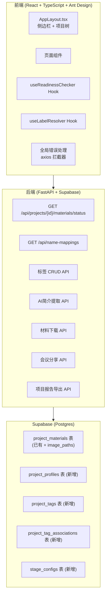
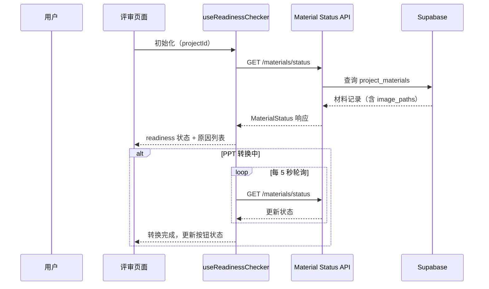

# 设计文档：AI评委系统体验增强

## 概述

本设计文档描述AI评委系统的全面体验增强方案，涵盖16项需求的技术实现。核心改进包括：

1. **评审就绪检查机制**：新增材料状态API，前端实现就绪检查器（Readiness Checker），控制评审按钮的启用/禁用状态，并支持PPT转换状态轮询
2. **中文标签与导航优化**：新增名称映射批量API，前端实现标签解析器；为所有子页面添加统一返回导航
3. **侧边栏项目树**：在 AppLayout 侧边栏中按赛事→赛道→组别层级展示项目树
4. **进度时间线增强**：在步骤条上显示各阶段日期
5. **会议分享与材料下载**：现场路演会议链接分享、材料版本历史下载
6. **AI项目简介提取**：后端AI服务从BP和文本PPT中提取结构化项目简介
7. **自定义标签系统**：支持彩色标签创建、关联和筛选
8. **全局错误处理**：统一的网络错误提示和重试机制
9. **项目数据导出**：生成包含评审结果的PDF报告

### 技术栈

- **后端**：Python FastAPI + Supabase (Postgres + Storage)，依赖管理使用 `uv`
- **前端**：React 18 + TypeScript + Ant Design 5 + Vite
- **AI**：DashScope（通义千问 qwen-vl-max）
- **实时音视频**：GetStream SDK
- **PPT转换**：后台异步任务（BackgroundTasks）

## 架构

### 整体架构图



### 数据流图：评审就绪检查



## 组件与接口

### 后端新增/修改接口

#### 1. 材料就绪状态 API

**文件**：`examples/web_ui_agent/backend/app/routes/materials.py`

```
GET /api/projects/{project_id}/materials/status
```

**响应体**：
```json
{
  "bp": { "uploaded": true, "ready": true },
  "text_ppt": { "uploaded": true, "image_paths_ready": true, "ready": true },
  "presentation_ppt": { "uploaded": true, "image_paths_ready": false, "ready": false },
  "presentation_video": { "uploaded": false, "ready": false },
  "any_text_material_ready": true,
  "offline_review_ready": false,
  "offline_review_reasons": ["请先上传路演视频"]
}
```

**实现**：在 `MaterialService` 中新增 `get_status` 方法，查询 `project_materials` 表中各类型的 `is_latest=True` 记录，检查 `image_paths` 字段是否非空。`any_text_material_ready` 为 `true` 当至少一种文本评审材料（bp、text_ppt、presentation_ppt）已就绪。`offline_review_ready` 为 `true` 当 `presentation_video` 已上传（视频是离线评审的核心材料，其他材料为辅助）。

#### 2. 名称映射批量 API

**文件**：`examples/web_ui_agent/backend/app/routes/competitions.py`

```
GET /api/name-mappings
```

**响应体**：
```json
{
  "competitions": { "guochuangsai": "中国国际大学生创新大赛（国创赛）", ... },
  "tracks": { "gaojiao": "高教主赛道", ... },
  "groups": { "benke_chuangyi": "本科创意组", ... }
}
```

**实现**：直接返回 `rule_service.py` 中已有的 `COMPETITION_NAMES`、`TRACK_NAMES`、`GROUP_NAMES` 字典。

#### 3. 材料版本下载 API

**文件**：`examples/web_ui_agent/backend/app/routes/materials.py`

```
GET /api/projects/{project_id}/materials/{material_id}/download
```

**响应体**：
```json
{
  "download_url": "https://xxx.supabase.co/storage/v1/object/sign/materials/...",
  "file_name": "商业计划书v2.pdf",
  "expires_in": 3600
}
```

**实现**：在 `MaterialService` 中新增 `get_download_url` 方法，使用 `supabase.storage.from_("materials").create_signed_url(file_path, 3600)` 生成签名URL。

#### 4. 文本评审 API 增强

**文件**：`examples/web_ui_agent/backend/app/services/text_review_service.py`

现有文本评审API需增加 `material_types` 参数支持：

```
POST /api/projects/{project_id}/text-review
```

**请求体新增字段**：
```json
{
  "material_types": ["bp", "text_ppt", "presentation_ppt"]
}
```

**实现**：`TextReviewService` 根据 `material_types` 列表仅加载用户选择的材料内容进行AI评审。若未传 `material_types`，默认使用所有已就绪材料（向后兼容）。

#### 5. 离线评审 API 说明

**文件**：`examples/web_ui_agent/backend/app/services/offline_review_service.py`（如存在）

离线评审以路演视频为核心材料，自动附加所有已就绪的辅助材料。辅助材料优先级：`presentation_ppt > text_ppt > bp`。

**行为**：
- 路演视频（`presentation_video`）为必需材料，未上传时不允许发起评审
- 辅助材料自动附加，无需用户选择
- 若路演PPT已上传但转换未完成，评审将不包含PPT辅助内容

#### 6. AI项目简介提取 API

**文件**：`examples/web_ui_agent/backend/app/routes/projects.py`（新增端点）

```
POST /api/projects/{project_id}/profile/extract
GET  /api/projects/{project_id}/profile
PUT  /api/projects/{project_id}/profile
```

**实现**：新增 `ProfileService`（`examples/web_ui_agent/backend/app/services/profile_service.py`），调用 `call_ai_api` 从BP和文本PPT内容中提取结构化字段。

#### 5. 自定义标签 CRUD API

**文件**：`examples/web_ui_agent/backend/app/routes/tags.py`（新增）

```
POST   /api/tags                          # 创建标签
GET    /api/tags                          # 获取用户所有标签
PUT    /api/tags/{tag_id}                 # 更新标签
DELETE /api/tags/{tag_id}                 # 删除标签
POST   /api/projects/{project_id}/tags    # 关联标签到项目
DELETE /api/projects/{project_id}/tags/{tag_id}  # 移除项目标签关联
```

**实现**：新增 `TagService`（`examples/web_ui_agent/backend/app/services/tag_service.py`）。

#### 8. 会议分享链接 API

**文件**：`examples/web_ui_agent/backend/app/routes/live_presentation.py`

```
POST /api/projects/{project_id}/live/{session_id}/share
GET  /api/live/join/{share_token}
```

**实现**：在 `LivePresentationService` 中新增 `generate_share_link` 方法，生成包含 session_id 和认证 token 的 URL。通过 GetStream SDK 的 `create_token` 为被邀请者生成临时访问令牌。

**前提条件**：需先完成前端 GetStream React Video SDK 集成，替换当前的视频占位符区域。当前前端尚未集成 GetStream React Video SDK，视频区域为占位符 div。后端API可先行实现，但前端分享功能需等待 SDK 集成后才能完整使用。

#### 7. 项目报告导出 API

**文件**：`examples/web_ui_agent/backend/app/routes/projects.py`

```
GET /api/projects/{project_id}/export
```

**响应**：`application/pdf` 二进制流

**实现**：新增 `ExportService`（`examples/web_ui_agent/backend/app/services/export_service.py`），使用 `reportlab` 或 `weasyprint` 生成PDF。

### 前端新增/修改组件

#### 1. `useReadinessChecker` Hook

**文件**：`examples/web_ui_agent/frontend/src/hooks/useReadinessChecker.ts`（新增）

```typescript
interface MaterialStatus {
  bp: { uploaded: boolean; ready: boolean };
  text_ppt: { uploaded: boolean; image_paths_ready: boolean; ready: boolean };
  presentation_ppt: { uploaded: boolean; image_paths_ready: boolean; ready: boolean };
  presentation_video: { uploaded: boolean; ready: boolean };
  any_text_material_ready: boolean;
  offline_review_ready: boolean;
  offline_review_reasons: string[];
}

function useReadinessChecker(projectId: string): {
  status: MaterialStatus | null;
  loading: boolean;
  refresh: () => void;
}
```

**行为**：
- 页面加载时调用 `GET /materials/status`
- 当 `text_ppt` 或 `presentation_ppt` 的 `image_paths_ready` 为 `false` 时，启动 5 秒间隔轮询
- 转换完成或超过 5 分钟后停止轮询
- 组件卸载时清理定时器

#### 2. `useLabelResolver` Hook

**文件**：`examples/web_ui_agent/frontend/src/hooks/useLabelResolver.ts`（新增）

```typescript
interface NameMappings {
  competitions: Record<string, string>;
  tracks: Record<string, string>;
  groups: Record<string, string>;
}

function useLabelResolver(): {
  resolve: (type: 'competition' | 'track' | 'group', id: string) => string;
  loading: boolean;
}
```

**行为**：
- 应用启动时调用 `GET /api/name-mappings` 获取映射表并缓存
- `resolve` 函数查找映射，未找到时回退返回原始 ID
- 使用 React Context 在全局共享映射数据，避免重复请求

#### 3. `BackButton` 通用组件

**文件**：`examples/web_ui_agent/frontend/src/components/BackButton.tsx`（新增）

```typescript
interface BackButtonProps {
  to: string;       // 目标路径
  label: string;    // 显示文案，如"返回项目仪表盘"
}
```

**行为**：渲染 `<Button type="text" icon={<ArrowLeftOutlined />}>` 样式，与 `ProjectDashboard` 已有的返回按钮风格一致。

#### 4. 文本评审材料选择区域

**集成位置**：`examples/web_ui_agent/frontend/src/pages/TextReview.tsx`（页面内嵌）

**行为**：
- 在文本评审页面顶部显示材料选择复选框区域
- 列出三种材料（bp、text_ppt、presentation_ppt），每种显示上传和就绪状态
- 已上传且就绪的材料默认勾选
- 未上传的材料置灰并标注"未上传"
- 已上传但转换未完成的PPT材料置灰并标注"转换中"
- 用户可自由勾选/取消已就绪的材料
- 至少勾选一种材料时启用"发起文本评审"按钮
- 发起评审时将选中的 `material_types` 列表传递给后端API

#### 5. `ReviewSelectionDialog` 评审选择对话框

**文件**：`examples/web_ui_agent/frontend/src/components/ReviewSelectionDialog.tsx`（新增）

**行为**：Ant Design Modal，在项目仪表盘中当多种评审类型均可用时弹出，提供三个选项卡片（仅文本评审、仅离线路演评审、两者都评审），点击后导航至对应页面。

#### 5. `ProjectTree` 侧边栏组件

**文件**：`examples/web_ui_agent/frontend/src/components/ProjectTree.tsx`（新增）

**行为**：
- 使用 Ant Design `Tree` 组件
- 数据来源：`projectApi.list()` 返回的项目列表，按 competition → track → group 分组
- 节点名称通过 `useLabelResolver` 解析为中文
- 点击叶子节点（项目）导航至 `/projects/{id}`
- 侧边栏折叠时隐藏

#### 6. 全局错误处理增强

**文件**：`examples/web_ui_agent/frontend/src/services/api.ts`（修改 axios 拦截器）

**行为**：
- 响应拦截器中捕获 4xx/5xx 错误，通过 `message.error()` 统一展示
- 新增 `NetworkStatusBar` 组件（`examples/web_ui_agent/frontend/src/components/NetworkStatusBar.tsx`），监听 `online`/`offline` 事件
- 错误通知中附带"重试"按钮，存储失败请求的配置用于重发
- 连续 3 次重试失败后显示兜底提示

#### 7. 页面修改清单

| 页面 | 文件 | 修改内容 |
|------|------|----------|
| ProjectDashboard | `ProjectDashboard.tsx` | 添加就绪状态标签、评审选择对话框、项目简介卡片、导出按钮、自定义标签、进度日期 |
| ProjectList | `ProjectList.tsx` | 中文标签显示、标签筛选 |
| TextReview | `TextReview.tsx` | 添加 BackButton、材料选择复选框区域、就绪检查禁用按钮、转换进度指示、传递 material_types 给后端 |
| OfflineReview | `OfflineReview.tsx` | 添加 BackButton、视频未上传时禁用按钮、辅助材料状态列表（含优先级说明）、转换进度指示 |
| MaterialCenter | `MaterialCenter.tsx` | 添加 BackButton、版本历史下载按钮 |
| ReviewHistory | `ReviewHistory.tsx` | 添加 BackButton |
| ReviewDetail | `ReviewDetail.tsx` | 添加 BackButton（返回评审历史） |
| LivePresentation | `LivePresentation.tsx` | 添加 BackButton、分享链接按钮（需 GetStream React SDK 集成后生效） |
| AppLayout | `AppLayout.tsx` | 集成 ProjectTree、NetworkStatusBar |

## 数据模型

### 现有表修改

#### `project_materials` 表

该表已存在，包含 `image_paths` 字段（PPT转换后的图像路径数组）。材料状态API将直接查询此表。

现有字段：`id`, `project_id`, `material_type`, `file_path`, `file_name`, `file_size`, `version`, `is_latest`, `image_paths`, `created_at`

无需修改表结构。

### 新增表

#### `project_profiles` 表

存储AI提取的项目简介。

```sql
CREATE TABLE project_profiles (
  id UUID PRIMARY KEY DEFAULT gen_random_uuid(),
  project_id UUID NOT NULL REFERENCES projects(id) ON DELETE CASCADE,
  team_intro TEXT,           -- 团队介绍
  domain TEXT,               -- 所属领域
  startup_status TEXT,       -- 创业状态
  achievements TEXT,         -- 已有成果
  product_links TEXT,        -- 产品链接
  next_goals TEXT,           -- 下一步目标
  is_ai_generated BOOLEAN DEFAULT TRUE,  -- 是否AI生成（用户编辑后设为false）
  source_material_versions JSONB,  -- 提取时使用的材料版本 {"bp": 1, "text_ppt": 2}
  created_at TIMESTAMPTZ DEFAULT NOW(),
  updated_at TIMESTAMPTZ DEFAULT NOW(),
  UNIQUE(project_id)
);
```

#### `project_tags` 表

存储用户创建的自定义标签。

```sql
CREATE TABLE project_tags (
  id UUID PRIMARY KEY DEFAULT gen_random_uuid(),
  user_id UUID NOT NULL REFERENCES auth.users(id) ON DELETE CASCADE,
  name VARCHAR(50) NOT NULL,
  color VARCHAR(20) NOT NULL,  -- 预设颜色值，如 "#f5222d"
  created_at TIMESTAMPTZ DEFAULT NOW(),
  UNIQUE(user_id, name)
);
```

#### `project_tag_associations` 表

项目与标签的多对多关联。

```sql
CREATE TABLE project_tag_associations (
  id UUID PRIMARY KEY DEFAULT gen_random_uuid(),
  project_id UUID NOT NULL REFERENCES projects(id) ON DELETE CASCADE,
  tag_id UUID NOT NULL REFERENCES project_tags(id) ON DELETE CASCADE,
  created_at TIMESTAMPTZ DEFAULT NOW(),
  UNIQUE(project_id, tag_id)
);
```

#### `stage_configs` 表

存储赛事各阶段的日期配置。

```sql
CREATE TABLE stage_configs (
  id UUID PRIMARY KEY DEFAULT gen_random_uuid(),
  competition VARCHAR(100) NOT NULL,
  track VARCHAR(100) NOT NULL,
  stage VARCHAR(50) NOT NULL,       -- 如 "school_text", "province_presentation"
  stage_date DATE,                   -- 阶段日期
  created_at TIMESTAMPTZ DEFAULT NOW(),
  UNIQUE(competition, track, stage)
);
```

### 新增 Pydantic 模型

**文件**：`examples/web_ui_agent/backend/app/models/schemas.py`

```python
class MaterialStatusItem(BaseModel):
    uploaded: bool
    image_paths_ready: bool | None = None  # 仅 PPT 类型有此字段
    ready: bool

class MaterialStatusResponse(BaseModel):
    bp: MaterialStatusItem
    text_ppt: MaterialStatusItem
    presentation_ppt: MaterialStatusItem
    presentation_video: MaterialStatusItem
    any_text_material_ready: bool
    offline_review_ready: bool
    offline_review_reasons: list[str]

class NameMappingsResponse(BaseModel):
    competitions: dict[str, str]
    tracks: dict[str, str]
    groups: dict[str, str]

class ProjectProfile(BaseModel):
    id: str
    project_id: str
    team_intro: str | None = None
    domain: str | None = None
    startup_status: str | None = None
    achievements: str | None = None
    product_links: str | None = None
    next_goals: str | None = None
    is_ai_generated: bool = True
    created_at: datetime
    updated_at: datetime

class ProjectProfileUpdate(BaseModel):
    team_intro: str | None = None
    domain: str | None = None
    startup_status: str | None = None
    achievements: str | None = None
    product_links: str | None = None
    next_goals: str | None = None

class TagCreate(BaseModel):
    name: str
    color: str

class TagResponse(BaseModel):
    id: str
    name: str
    color: str
    created_at: datetime

class DownloadUrlResponse(BaseModel):
    download_url: str
    file_name: str
    expires_in: int

class ShareLinkResponse(BaseModel):
    share_url: str
    expires_in: int

class StageConfigResponse(BaseModel):
    stage: str
    stage_date: str | None  # "YYYY-MM-DD" 或 None
```

### 前端新增 TypeScript 类型

**文件**：`examples/web_ui_agent/frontend/src/types/index.ts`

```typescript
export interface MaterialStatusItem {
  uploaded: boolean;
  image_paths_ready?: boolean;
  ready: boolean;
}

export interface MaterialStatusResponse {
  bp: MaterialStatusItem;
  text_ppt: MaterialStatusItem;
  presentation_ppt: MaterialStatusItem;
  presentation_video: MaterialStatusItem;
  any_text_material_ready: boolean;
  offline_review_ready: boolean;
  offline_review_reasons: string[];
}

export interface NameMappings {
  competitions: Record<string, string>;
  tracks: Record<string, string>;
  groups: Record<string, string>;
}

export interface ProjectProfile {
  id: string;
  project_id: string;
  team_intro?: string;
  domain?: string;
  startup_status?: string;
  achievements?: string;
  product_links?: string;
  next_goals?: string;
  is_ai_generated: boolean;
  created_at: string;
  updated_at: string;
}

export interface TagInfo {
  id: string;
  name: string;
  color: string;
  created_at: string;
}

export interface StageConfig {
  stage: string;
  stage_date: string | null;
}
```

## 正确性属性

*正确性属性是在系统所有有效执行中都应成立的特征或行为——本质上是关于系统应该做什么的形式化陈述。属性是人类可读规范与机器可验证正确性保证之间的桥梁。*

### Property 1: 材料状态API正确反映上传和就绪状态

*For any* 项目及其任意材料上传组合（四种材料类型各自可能已上传或未上传，PPT类型的 image_paths 可能为空或非空），Material Status API 返回的每个材料类型的 `uploaded` 字段应等于该类型在 `project_materials` 表中存在 `is_latest=True` 的记录，PPT类型的 `image_paths_ready` 字段应等于 `image_paths` 非空。

**Validates: Requirements 1.1, 1.2**

### Property 2: 文本评审材料就绪条件判定

*For any* 材料状态组合，`any_text_material_ready` 为 `true` 当且仅当 bp、text_ppt、presentation_ppt 中至少有一种材料已就绪（bp 已上传即就绪；PPT类型需 `uploaded` 且 `image_paths_ready`）。

**Validates: Requirements 2.1, 2.2, 2.3, 2.4**

### Property 3: 离线路演评审就绪条件判定

*For any* 材料状态组合，`offline_review_ready` 为 `true` 当且仅当 `presentation_video.uploaded` 为 `true`（视频是离线评审的核心必需材料）。当 `offline_review_ready` 为 `false` 时，`offline_review_reasons` 列表非空且包含"请先上传路演视频"。

**Validates: Requirements 3.1, 3.2, 3.3, 3.4, 3.5**

### Property 4: 名称解析器正确映射与回退

*For any* 英文ID字符串和名称映射字典，当ID存在于映射中时，`resolve` 函数返回对应的中文名称；当ID不存在于映射中时，`resolve` 函数返回原始英文ID。

**Validates: Requirements 7.1, 7.4**

### Property 5: 项目树按层级正确分组且无空节点

*For any* 项目列表，构建的项目树应满足：(a) 第一级节点为赛事，第二级为赛道，第三级为组别，第四级为项目；(b) 每个非叶子节点至少包含一个子节点；(c) 每个项目恰好出现在其对应的赛事→赛道→组别路径下。

**Validates: Requirements 9.2, 9.6**

### Property 6: 阶段日期格式化

*For any* 有效日期值，Progress Timeline 组件应以 "YYYY-MM-DD" 格式显示该日期。

**Validates: Requirements 10.2**

### Property 7: 会议分享链接包含必要参数

*For any* 生成的会议分享链接，URL 应包含有效的 session_id 参数和认证 token 参数。

**Validates: Requirements 11.4**

### Property 8: AI简介提取结果结构验证

*For any* AI简介提取API的成功响应，返回的 `ProjectProfile` 对象应包含所有六个结构化字段（team_intro、domain、startup_status、achievements、product_links、next_goals），且每个字段为字符串类型或 null。

**Validates: Requirements 13.2**

### Property 9: 标签筛选正确性

*For any* 项目列表和选定的标签，筛选后的结果应仅包含与该标签关联的项目，且不遗漏任何关联项目。

**Validates: Requirements 14.6**

### Property 10: 全局错误拦截器统一处理

*For any* HTTP 响应状态码在 400-599 范围内的API请求，axios 响应拦截器应触发统一的错误通知展示，且通知内容包含可读的错误信息。

**Validates: Requirements 15.1**

### Property 11: 项目报告导出内容完整性

*For any* 项目，导出的PDF报告应包含项目基本信息（名称、赛事、赛道、组别）和材料状态。若项目有评审记录，报告应包含评审结果摘要和评分汇总；若无评审记录，报告应包含"暂无评审记录"标注。

**Validates: Requirements 16.2, 16.3, 16.4**

## 错误处理

### 后端错误处理

| 场景 | HTTP状态码 | 错误信息 | 处理方式 |
|------|-----------|---------|---------|
| 材料状态查询失败 | 500 | "查询材料状态失败" | 返回 ErrorResponse，前端显示重试 |
| 名称映射查询失败 | 500 | "获取名称映射失败" | 前端回退使用英文ID |
| 材料下载URL生成失败 | 404 | "文件不存在或已过期" | 前端显示"文件不可用" |
| AI简介提取失败 | 503 | "AI服务暂时不可用" | 前端显示错误，允许手动填写 |
| 标签名称重复 | 409 | "标签名称已存在" | 前端提示用户修改名称 |
| 会议已结束 | 410 | "会议已结束" | 前端显示"会议已结束"提示 |
| 分享链接无效 | 404 | "分享链接无效或已过期" | 前端显示错误页面 |
| PDF导出失败 | 500 | "导出报告失败" | 前端显示重试按钮 |
| 轮询超时（5分钟） | N/A（前端逻辑） | "转换超时，请检查材料或重新上传" | 前端停止轮询，显示提示 |

### 前端全局错误处理策略

1. **axios 响应拦截器增强**：
   - 4xx/5xx 错误统一通过 `message.error()` 展示
   - 401 错误清除 token 并跳转登录（已有）
   - 网络错误（无响应）触发 NetworkStatusBar 显示

2. **重试机制**：
   - 错误通知中附带"重试"按钮
   - 存储失败请求的 `AxiosRequestConfig` 用于重发
   - 连续 3 次重试失败后显示"请检查网络连接或联系管理员"

3. **网络状态监听**：
   - 监听 `window.addEventListener('online'/'offline')` 事件
   - 离线时在 AppLayout 顶部显示持续性提示条
   - 恢复在线时自动隐藏

## 测试策略

### 测试框架选择

- **后端单元测试**：`pytest` + `pytest-asyncio`
- **后端属性测试**：`hypothesis`（Python 属性测试库）
- **前端单元测试**：`vitest` + `@testing-library/react`
- **前端属性测试**：`fast-check`（TypeScript 属性测试库）

### 属性测试（Property-Based Testing）

每个正确性属性对应一个属性测试，最少运行 100 次迭代。

| Property | 测试文件 | 测试库 | 说明 |
|----------|---------|--------|------|
| Property 1 | `tests/test_material_status.py` | hypothesis | 生成随机材料上传组合，验证状态API响应 |
| Property 2 | `tests/test_readiness.py` | hypothesis | 生成随机材料状态，验证文本评审就绪逻辑 |
| Property 3 | `tests/test_readiness.py` | hypothesis | 生成随机材料状态，验证离线评审就绪逻辑 |
| Property 4 | `frontend/src/__tests__/labelResolver.test.ts` | fast-check | 生成随机ID和映射，验证解析逻辑 |
| Property 5 | `frontend/src/__tests__/projectTree.test.ts` | fast-check | 生成随机项目列表，验证树构建逻辑 |
| Property 6 | `frontend/src/__tests__/dateFormat.test.ts` | fast-check | 生成随机日期，验证格式化输出 |
| Property 7 | `tests/test_share_link.py` | hypothesis | 生成随机session_id，验证链接结构 |
| Property 8 | `tests/test_profile_service.py` | hypothesis | 生成随机AI响应，验证解析结果结构 |
| Property 9 | `frontend/src/__tests__/tagFilter.test.ts` | fast-check | 生成随机项目和标签，验证筛选逻辑 |
| Property 10 | `frontend/src/__tests__/errorHandler.test.ts` | fast-check | 生成随机错误状态码，验证拦截器行为 |
| Property 11 | `tests/test_export_service.py` | hypothesis | 生成随机项目数据，验证PDF内容 |

**标签格式**：每个属性测试必须包含注释引用设计属性，格式为：
```
# Feature: system-experience-enhancement, Property {number}: {property_text}
```

### 单元测试

单元测试聚焦于具体示例、边界情况和集成点：

- **材料状态API**：空项目、部分上传、全部上传的具体场景
- **轮询超时**：模拟5分钟超时场景
- **返回按钮导航**：各页面的返回目标正确性
- **评审选择对话框**：三种选项的导航行为
- **网络状态**：离线/在线切换
- **重试机制**：连续失败计数和兜底提示
- **会议已结束**：分享链接指向已结束会议的处理
- **文件不可用**：Supabase Storage 文件不存在的处理
- **AI提取失败**：DashScope API 超时或错误的处理
- **空评审记录导出**：无评审记录时PDF内容验证
