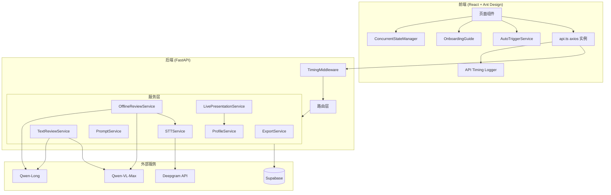
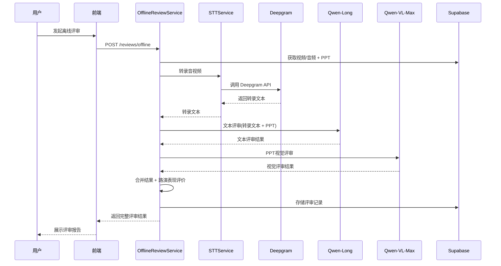

# Design Document: System Optimization V2

## Overview

本设计文档描述创赛评审系统（web_ui_agent）第二轮系统优化的技术方案。优化涵盖七个核心方向共13个需求，涉及后端 Python FastAPI 服务层改造、前端 React/Ant Design 组件增强、Supabase 数据模型扩展、以及新增 STT（语音转文字）和视觉模型（Qwen-VL-Max）集成。

### 技术栈

- 后端：Python 3.12+ / FastAPI / Supabase (PostgreSQL + Storage + Auth)
- 前端：React 18 / TypeScript / Vite / Ant Design
- AI 服务：通义千问 Qwen-Long（文本评审）、Qwen-VL-Max（视觉评审/离线路演）
- STT 服务：Deepgram API
- 实时通信：GetStream

### 变更范围

| 方向 | 需求 | 影响模块 |
|------|------|----------|
| PDF导出中文标签 | R1 | ExportService |
| 文本评审增强 | R2, R3, R4 | TextReviewService, TextReview.tsx, ReviewHistory.tsx, TextReviewPanel.tsx |
| 离线评审增强 | R5, R6, R7, R8 | OfflineReviewService, OfflineReview.tsx, MaterialService, STT集成 |
| 现场路演优化 | R9 | LivePresentationService, PromptService |
| 界面美化 | R10 | TextReviewPanel.tsx |
| API耗时监控 | R11 | 新增 API_Timing_Logger 中间件, 前端 axios 拦截器 |
| 用户引导与自动触发 | R12 | 新增 OnboardingGuide 组件, AutoTriggerService |
| 并发状态管理 | R13 | 新增 ConcurrentStateManager hook |

## Architecture

### 系统架构图



### 数据流：离线评审增强流程



## Components and Interfaces

### 1. ExportService 改造 (R1)

在 `ExportService._build_pdf()` 中引入 `Name_Mappings` 进行中文标签转换。

```python
# export_service.py 新增导入
from app.services.rule_service import COMPETITION_NAMES, TRACK_NAMES, GROUP_NAMES

REVIEW_TYPE_LABELS: dict[str, str] = {
    "text_review": "文本评审",
    "offline_presentation": "离线路演",
    "live_presentation": "现场路演",
}

def _resolve_name(value: str, mapping: dict[str, str]) -> str:
    """将英文ID转换为中文名称，映射不存在时回退显示原始值。"""
    return mapping.get(value, value)
```

改造点：
- `_build_pdf()` 中项目信息部分：competition/track/group 字段通过 `_resolve_name()` 转换
- 评审结果表格中：review_type 字段通过 `REVIEW_TYPE_LABELS` 转换

### 2. TextReviewService 改造 (R2, R3, R4)

#### R2: 材料选择简化

修改 `VALID_MATERIAL_TYPES` 为仅包含 `text_ppt` 和 `bp`：

```python
VALID_MATERIAL_TYPES = {"text_ppt", "bp"}
```

修改错误提示为"请先上传文本PPT或BP材料"。

#### R3: 评审记录中保存所选材料

在 reviews 表 insert 时新增 `selected_materials` 字段：

```python
review_row = self._sb.table("reviews").insert({
    ...
    "selected_materials": requested,  # ["text_ppt", "bp"]
}).execute()
```

#### R4: PPT视觉评审

在 `TextReviewService.review()` 末尾新增视觉评审步骤：

```python
# 如果选择了 text_ppt，额外调用 Qwen-VL-Max 进行视觉评审
ppt_visual_result = None
if has_text_ppt and text_ppt:
    ppt_visual_result = await self._ppt_visual_review(text_ppt)
```

新增方法 `_ppt_visual_review()`：
- 从 Supabase Storage 下载 PPT 文件
- 上传到 DashScope 临时 OSS
- 使用 `prompts/templates/ppt_visual_review.md` 模板组装 prompt
- 调用 Qwen-VL-Max 进行视觉评审
- 解析返回的六维度评价结果

`ReviewResult` schema 扩展：

```python
class ReviewResult(BaseModel):
    ...
    ppt_visual_review: dict | None = None  # PPT视觉评审结果
```

### 3. 新增 STTService (R6)

新建 `app/services/stt_service.py`：

```python
class STTService:
    """语音转文字服务，使用 Deepgram API。"""
    
    def __init__(self):
        self._api_key = settings.deepgram_api_key
    
    async def transcribe(self, audio_content: bytes, mime_type: str = "audio/mp4") -> str:
        """将音频/视频内容转录为文本。
        
        Args:
            audio_content: 音频/视频文件的字节内容
            mime_type: MIME 类型
            
        Returns:
            转录文本
            
        Raises:
            RuntimeError: 转录失败
        """
```

接口设计：
- 使用 `httpx.AsyncClient` 调用 Deepgram REST API
- 支持 `audio/mp4`, `audio/mpeg`, `audio/wav`, `audio/x-m4a`, `audio/aac` MIME 类型
- 配置参数：`language=zh`, `model=nova-2`, `smart_format=true`

### 4. OfflineReviewService 改造 (R5, R6, R7, R8)

#### R5: 支持音频文件上传

修改材料校验逻辑，支持 `presentation_audio` 类型：

```python
presentation_video = await self._material_svc.get_latest(project_id, "presentation_video")
presentation_audio = await self._material_svc.get_latest(project_id, "presentation_audio")

if not presentation_video and not presentation_audio:
    raise HTTPException(status_code=400, detail="请先上传路演视频或路演音频后再发起离线评审")
```

#### R6: STT 转文字集成

在评审流程中新增 STT 步骤：

```python
# 下载视频/音频 → STT 转录
media_material = presentation_video or presentation_audio
media_content = self._sb.storage.from_(STORAGE_BUCKET).download(media_material["file_path"])
transcript = await self._stt_service.transcribe(media_content, mime_type)

# 将转录文本与 PPT 一起传给 Qwen-Long
```

#### R7: PPT 视觉评审

复用 `PPT_Visual_Review` 的 prompt 模板，在 Qwen-Long 文本评审完成后调用 Qwen-VL-Max。

#### R8: 路演者评价

在 prompt 模板中新增路演表现评价维度，基于 STT 转录文本分析路演者表达特点。

### 5. LivePresentationService 改造 (R9)

在 `start_session()` 中查询并注入项目简介：

```python
# 查询项目简介
profile = await self._profile_svc.get_profile(project_id)

# 构建材料内容描述
material_content = f"路演PPT文件: {presentation_ppt['file_name']} (版本 {presentation_ppt['version']})"

if profile:
    profile_parts = []
    field_labels = {
        "team_intro": "团队介绍",
        "domain": "所属领域",
        "startup_status": "创业状态",
        "achievements": "已有成果",
        "product_links": "产品链接",
        "next_goals": "下一步目标",
    }
    for field, label in field_labels.items():
        value = profile.get(field)
        if value:
            profile_parts.append(f"{label}: {value}")
    if profile_parts:
        material_content += "\n\n## 项目简介\n" + "\n".join(profile_parts)
```

### 6. API Timing Logger (R11)

#### 后端：FastAPI 中间件

新建 `app/utils/timing_middleware.py`：

```python
class TimingMiddleware:
    """API 调用耗时监控中间件。"""
    
    async def __call__(self, request, call_next):
        start = time.perf_counter()
        response = await call_next(request)
        total_ms = (time.perf_counter() - start) * 1000
        
        logger.info("api_timing", extra={
            "api_path": request.url.path,
            "method": request.method,
            "total_ms": round(total_ms, 2),
            "status_code": response.status_code,
        })
        return response
```

#### 外部服务调用计时

新建 `app/utils/timing.py`，提供上下文管理器：

```python
class TimingContext:
    """记录外部服务调用耗时的上下文管理器。"""
    
    def __init__(self):
        self.stages: list[dict] = []
    
    @contextmanager
    def track(self, stage_name: str):
        start = time.perf_counter()
        yield
        elapsed_ms = (time.perf_counter() - start) * 1000
        self.stages.append({"stage": stage_name, "ms": round(elapsed_ms, 2)})
    
    def summary(self) -> dict:
        return {"stages": self.stages, "total_ms": sum(s["ms"] for s in self.stages)}
```

#### 前端：axios 拦截器

在 `api.ts` 的请求/响应拦截器中添加 `console.log` 计时：

```typescript
api.interceptors.request.use((config) => {
    config.metadata = { startTime: performance.now() };
    return config;
});

api.interceptors.response.use((res) => {
    const elapsed = performance.now() - res.config.metadata?.startTime;
    console.log(`[API Timing] ${res.config.method?.toUpperCase()} ${res.config.url} - ${elapsed.toFixed(0)}ms`);
    return res;
});
```

### 7. 前端 OnboardingGuide 组件 (R12)

新建 `src/components/OnboardingGuide.tsx`：

```typescript
interface OnboardingGuideProps {
    projectId: string;
    trigger: string;  // 触发条件标识，如 "project_created"
    message: string;
    onClose: () => void;
}
```

引导状态存储在 `localStorage`，key 格式：`onboarding_${projectId}_${trigger}`。

### 8. 前端 AutoTriggerService (R12)

在材料上传成功回调中自动触发 AI 项目简历总结：

```typescript
// MaterialCenter.tsx 中材料上传成功后
if (materialType === 'bp' || materialType === 'text_ppt') {
    setProfileGenerating(true);
    profileApi.extract(projectId)
        .then(profile => setProjectProfile(profile))
        .catch(() => setProfileError(true))
        .finally(() => setProfileGenerating(false));
}
```

### 9. ConcurrentStateManager Hook (R13)

新建 `src/hooks/useConcurrentState.ts`：

```typescript
type OperationType = 'upload_bp' | 'upload_text_ppt' | 'upload_presentation_ppt' | 
    'upload_presentation_video' | 'upload_presentation_audio' |
    'profile_extract' | 'text_review' | 'offline_review' | 'export_pdf';

type OperationStatus = 'idle' | 'loading' | 'success' | 'error';

interface OperationState {
    status: OperationStatus;
    error?: string;
}

function useConcurrentState() {
    const [states, setStates] = useState<Record<string, OperationState>>({});
    
    const startOperation = (opId: string) => { ... };
    const completeOperation = (opId: string) => { ... };
    const failOperation = (opId: string, error: string) => { ... };
    const getStatus = (opId: string): OperationStatus => { ... };
    
    return { states, startOperation, completeOperation, failOperation, getStatus };
}
```

### 10. TextReviewPanel 美化 (R10)

改造 `TextReviewPanel.tsx`：
- 评分维度表格使用 Ant Design `Table` 组件替代 `Collapse`，统一列宽和对齐
- 子项评价使用 `Descriptions` 组件，统一缩进和分隔
- 改进建议使用 `List` 组件，统一段落间距
- 新增 PPT 视觉评审独立区块（`Card` 组件）
- 添加响应式样式，确保不同屏幕宽度下不错位

## Data Models

### Supabase 数据库变更

#### 1. reviews 表扩展

```sql
-- 新增 selected_materials 字段
ALTER TABLE reviews ADD COLUMN selected_materials text[] DEFAULT NULL;

-- 新增 ppt_visual_review 字段（存储 PPT 视觉评审结果 JSON）
ALTER TABLE reviews ADD COLUMN ppt_visual_review jsonb DEFAULT NULL;

-- 新增 presenter_evaluation 字段（存储路演者评价 JSON）
ALTER TABLE reviews ADD COLUMN presenter_evaluation jsonb DEFAULT NULL;

-- 新增 stt_transcript 字段（存储 STT 转录文本）
ALTER TABLE reviews ADD COLUMN stt_transcript text DEFAULT NULL;
```

#### 2. project_materials 表扩展

```sql
-- 支持新的材料类型 presentation_audio
-- 无需 DDL 变更，material_type 为 text 类型，直接支持新值
```

#### 3. 新增 api_timing_logs 表（可选，用于持久化耗时日志）

```sql
CREATE TABLE api_timing_logs (
    id uuid DEFAULT gen_random_uuid() PRIMARY KEY,
    api_path text NOT NULL,
    method text NOT NULL,
    total_ms numeric NOT NULL,
    stages jsonb DEFAULT '[]',
    status_code int,
    created_at timestamptz DEFAULT now()
);
```

### Pydantic Schema 变更

#### ReviewResult 扩展

```python
class ReviewResult(BaseModel):
    id: str
    review_type: str
    total_score: float
    dimensions: list[DimensionScore]
    overall_suggestions: list[str]
    status: str
    created_at: datetime
    selected_materials: list[str] | None = None       # R3
    ppt_visual_review: dict | None = None              # R4, R7
    presenter_evaluation: dict | None = None           # R8
```

#### PPT 视觉评审结果结构

```python
class PPTVisualReviewResult(BaseModel):
    """PPT 视觉评审结果"""
    dimensions: list[PPTVisualDimension]
    overall_comment: str

class PPTVisualDimension(BaseModel):
    """PPT 视觉评审单维度"""
    name: str           # 信息结构/信息密度/视觉设计/图示表达/说服力/完整性
    rating: str         # 优秀/良好/一般/较差
    comment: str        # 具体评价
    suggestions: list[str]  # 改进建议（优秀时可为空）
```

#### 路演者评价结构

```python
class PresenterEvaluation(BaseModel):
    """路演者表现评价"""
    language_expression: str    # 语言表达评价
    rhythm_control: str         # 节奏控制评价
    logic_clarity: str          # 逻辑清晰度评价
    engagement: str             # 互动感评价
    overall_comment: str        # 总体评价
    suggestions: list[str]      # 改进建议
```

#### MaterialStatusResponse 扩展

```python
class MaterialStatusResponse(BaseModel):
    bp: MaterialStatusItem
    text_ppt: MaterialStatusItem
    presentation_ppt: MaterialStatusItem
    presentation_video: MaterialStatusItem
    presentation_audio: MaterialStatusItem              # R5 新增
    any_text_material_ready: bool
    offline_review_ready: bool
    offline_review_reasons: list[str]
```

### TypeScript 类型变更

```typescript
// types/index.ts 扩展
export interface ReviewResult {
    ...
    selected_materials?: string[];
    ppt_visual_review?: PPTVisualReviewResult;
    presenter_evaluation?: PresenterEvaluation;
}

export interface PPTVisualReviewResult {
    dimensions: PPTVisualDimension[];
    overall_comment: string;
}

export interface PPTVisualDimension {
    name: string;
    rating: string;
    comment: string;
    suggestions: string[];
}

export interface PresenterEvaluation {
    language_expression: string;
    rhythm_control: string;
    logic_clarity: string;
    engagement: string;
    overall_comment: string;
    suggestions: string[];
}

export type MaterialType =
    | 'bp'
    | 'text_ppt'
    | 'presentation_ppt'
    | 'presentation_video'
    | 'presentation_audio';  // R5 新增

export interface MaterialStatusResponse {
    ...
    presentation_audio: MaterialStatusItem;  // R5 新增
}
```

### 新增 Prompt 模板文件

`prompts/templates/ppt_visual_review.md`：基于 `文本PPT视觉.md` 的六维度评审框架，包含信息结构、信息密度、视觉设计、图示表达、说服力、完整性六个维度的评审指引和输出格式要求。

### 配置变更

`app/config.py` 新增：

```python
class Settings(BaseSettings):
    ...
    deepgram_api_key: str = ""  # R6: Deepgram STT API Key
```


## Correctness Properties

*A property is a characteristic or behavior that should hold true across all valid executions of a system — essentially, a formal statement about what the system should do. Properties serve as the bridge between human-readable specifications and machine-verifiable correctness guarantees.*

### Property 1: Name resolution mapping

*For any* string value and any name mapping dictionary (COMPETITION_NAMES, TRACK_NAMES, GROUP_NAMES, REVIEW_TYPE_LABELS), `_resolve_name(value, mapping)` should return `mapping[value]` if the key exists, otherwise return the original `value` unchanged.

**Validates: Requirements 1.1, 1.2, 1.3, 1.4, 1.5**

### Property 2: Text review material type validation

*For any* material type string, `TextReviewService` should accept it as valid if and only if it is in the set `{"text_ppt", "bp"}`. Any other material type string should be filtered out from the requested list.

**Validates: Requirements 2.1**

### Property 3: Selected materials round-trip storage

*For any* non-empty subset of valid material types used in a text review, after the review record is stored to the `reviews` table, querying that record's `selected_materials` field should return exactly the same set of material types.

**Validates: Requirements 3.1**

### Property 4: Material type label resolution for display

*For any* list of material type IDs (e.g., `["text_ppt", "bp"]`), the label resolution function should produce a comma-separated Chinese label string (e.g., "文本PPT、BP") where each ID maps to its known Chinese label, and unknown IDs fall back to the raw ID.

**Validates: Requirements 3.2**

### Property 5: Text review with text_ppt includes PPT visual review

*For any* text review where `text_ppt` is in the selected materials and the text_ppt material exists, the returned `ReviewResult` should contain a non-null `ppt_visual_review` field with a valid `PPTVisualReviewResult` structure.

**Validates: Requirements 4.1, 4.3**

### Property 6: PPT visual review has exactly six dimensions

*For any* `PPTVisualReviewResult`, the `dimensions` list should contain exactly 6 entries with names matching the set: {信息结构, 信息密度, 视觉设计, 图示表达, 说服力, 完整性}.

**Validates: Requirements 4.2**

### Property 7: Excellent PPT rating produces no forced suggestions

*For any* `PPTVisualDimension` where `rating` is "优秀", the `suggestions` list should be empty (no forced improvement suggestions for excellent dimensions).

**Validates: Requirements 4.4**

### Property 8: Audio file type validation

*For any* file with extension in `{mp3, wav, m4a, aac}`, the material upload service should accept it and store it with `material_type = "presentation_audio"`. For any file with an extension not in this set (and not in other valid material extensions), the upload should be rejected.

**Validates: Requirements 5.1, 5.2**

### Property 9: Offline review media prerequisite

*For any* combination of `(has_video: bool, has_audio: bool)`, `OfflineReviewService` should allow the review to proceed if and only if `has_video or has_audio` is true.

**Validates: Requirements 5.3**

### Property 10: STT transcript included in assembled prompt

*For any* offline review where STT transcription succeeds, the prompt assembled for Qwen-Long should contain the transcript text as a substring within the material content section.

**Validates: Requirements 6.3**

### Property 11: Offline review with PPT includes visual review

*For any* offline review where `presentation_ppt` material exists, the returned result should contain a non-null `ppt_visual_review` field.

**Validates: Requirements 7.1**

### Property 12: Offline review result contains presenter evaluation

*For any* completed offline review result, the `presenter_evaluation` field should be non-null and contain all required fields: `language_expression`, `rhythm_control`, `logic_clarity`, `engagement`, `overall_comment`, and `suggestions`.

**Validates: Requirements 8.1**

### Property 13: Live session prompt contains project profile fields

*For any* live presentation session where a `ProjectProfile` exists with non-null fields, the assembled prompt should contain each non-null field's value as a substring. When no profile exists, the prompt should contain only the PPT file information.

**Validates: Requirements 9.1, 9.2, 9.3**

### Property 14: API timing output structure

*For any* API request processed by the `TimingMiddleware`, the timing log output should be a structured object containing `api_path` (string), `total_ms` (number ≥ 0), and `stages` (array). Each stage entry should contain `stage` (string) and `ms` (number ≥ 0). The sum of all stage `ms` values should be ≤ `total_ms`.

**Validates: Requirements 11.1, 11.2, 11.3, 11.6**

### Property 15: Onboarding guide dismissal persistence

*For any* project ID and trigger combination, after the onboarding guide is dismissed (stored in localStorage), querying the dismissed state should return true, and the guide should not be shown again for the same combination.

**Validates: Requirements 12.2**

### Property 16: Auto-trigger fires on bp/text_ppt upload

*For any* successful material upload where `material_type` is `"bp"` or `"text_ppt"`, the auto-trigger service should invoke the profile extraction API. For any other material type, the auto-trigger should not fire.

**Validates: Requirements 12.3**

### Property 17: Concurrent state isolation

*For any* set of operation IDs managed by `ConcurrentStateManager`, updating the state of one operation (start, complete, or fail) should not change the state of any other operation. Formally: for operations A and B, if we record the state of B, then perform a state transition on A, the state of B should remain unchanged.

**Validates: Requirements 13.1, 13.2, 13.4, 13.5, 13.6**

### Property 18: Concurrent state persistence across navigation

*For any* operation that is in "loading" state, if the component unmounts and remounts (simulating page navigation), the operation's state should be recoverable and reflect its actual current status.

**Validates: Requirements 13.3**

## Error Handling

### 后端错误处理

| 场景 | HTTP 状态码 | 错误信息 | 处理方式 |
|------|------------|---------|---------|
| 文本评审无有效材料 (R2) | 400 | "请先上传文本PPT或BP材料" | 前端展示错误提示 |
| 离线评审无视频/音频 (R5) | 400 | "请先上传路演视频或路演音频后再发起离线评审" | 前端展示错误提示 |
| STT 转录失败 (R6) | 502 | "语音转文字失败，请检查音频质量或稍后重试" | 前端展示错误提示 + 重试按钮 |
| Qwen-VL-Max 视觉评审失败 (R4, R7) | 503 | "PPT视觉评审服务暂时不可用" | 降级处理：返回文本评审结果，ppt_visual_review 为 null |
| Deepgram API Key 未配置 (R6) | 500 | "STT 服务未配置" | 启动时日志警告 |
| 名称映射缺失 (R1) | - | 回退显示原始英文ID | 静默降级，不报错 |
| 项目简介提取失败 (R12) | 502/503 | "AI项目简介生成失败" | 前端展示错误 + 重试按钮 |

### 降级策略

1. PPT 视觉评审失败时，文本评审/离线评审主流程不受影响，仅 `ppt_visual_review` 字段为 null
2. STT 转录失败时，离线评审整体失败（因为转录文本是核心输入）
3. 项目简介不存在时，现场路演 prompt 仅包含 PPT 信息（保持向后兼容）
4. 名称映射缺失时，静默回退到原始英文 ID

### 前端错误处理

- 所有 API 调用错误通过 axios 响应拦截器统一展示 `msg.error()`
- 自动触发失败时展示内联错误提示 + 重试按钮
- 并发状态管理器中每个操作独立维护错误状态

## Testing Strategy

### 测试框架选择

- 后端：`pytest` + `hypothesis`（Python property-based testing 库）
- 前端：`vitest` + `fast-check`（TypeScript property-based testing 库）+ `@testing-library/react`

### 单元测试

单元测试聚焦于具体示例、边界条件和错误处理：

1. `_resolve_name()` 函数：已知映射的具体示例（如 "guochuangsai" → "中国国际大学生创新大赛（国创赛）"）
2. `TextReviewService` 材料校验：空材料列表、无效材料类型
3. `STTService.transcribe()`：空音频、无效格式、API 超时
4. `OfflineReviewService` 前置条件：无视频无音频、仅有音频、仅有视频
5. `TimingMiddleware`：正常请求、异常请求的耗时记录
6. `ConcurrentStateManager`：初始状态、单操作生命周期
7. `OnboardingGuide`：首次展示、关闭后不再展示
8. PPT 视觉评审结果解析：正常 JSON、畸形 JSON、缺失字段

### Property-Based Testing

每个 property test 至少运行 100 次迭代，使用随机生成的输入验证通用属性。

后端 property tests 使用 `hypothesis` 库，前端使用 `fast-check` 库。

每个 property test 必须以注释标注对应的设计文档 property：

```python
# Feature: system-optimization-v2, Property 1: Name resolution mapping
@given(st.text(), st.dictionaries(st.text(), st.text()))
def test_name_resolution_mapping(value, mapping):
    result = _resolve_name(value, mapping)
    if value in mapping:
        assert result == mapping[value]
    else:
        assert result == value
```

```typescript
// Feature: system-optimization-v2, Property 17: Concurrent state isolation
test('concurrent state isolation', () => {
    fc.assert(fc.property(
        fc.array(fc.string(), { minLength: 2 }),
        (opIds) => { ... }
    ), { numRuns: 100 });
});
```

### Property Tests 与需求映射

| Property | 测试位置 | 框架 |
|----------|---------|------|
| P1: Name resolution mapping | backend/tests/test_name_resolution.py | hypothesis |
| P2: Text review material validation | backend/tests/test_text_review.py | hypothesis |
| P3: Selected materials round-trip | backend/tests/test_text_review.py | hypothesis |
| P4: Material type label resolution | frontend/src/__tests__/labelResolver.test.ts | fast-check |
| P5: Text review includes visual review | backend/tests/test_text_review.py | hypothesis |
| P6: PPT visual review dimensions | backend/tests/test_ppt_visual.py | hypothesis |
| P7: Excellent rating no suggestions | backend/tests/test_ppt_visual.py | hypothesis |
| P8: Audio file type validation | backend/tests/test_material.py | hypothesis |
| P9: Offline review media prerequisite | backend/tests/test_offline_review.py | hypothesis |
| P10: STT transcript in prompt | backend/tests/test_offline_review.py | hypothesis |
| P11: Offline review includes visual | backend/tests/test_offline_review.py | hypothesis |
| P12: Presenter evaluation structure | backend/tests/test_offline_review.py | hypothesis |
| P13: Live session prompt with profile | backend/tests/test_live_presentation.py | hypothesis |
| P14: API timing output structure | backend/tests/test_timing.py | hypothesis |
| P15: Onboarding dismissal persistence | frontend/src/__tests__/onboarding.test.ts | fast-check |
| P16: Auto-trigger on upload | frontend/src/__tests__/autoTrigger.test.ts | fast-check |
| P17: Concurrent state isolation | frontend/src/__tests__/concurrentState.test.ts | fast-check |
| P18: Concurrent state persistence | frontend/src/__tests__/concurrentState.test.ts | fast-check |
